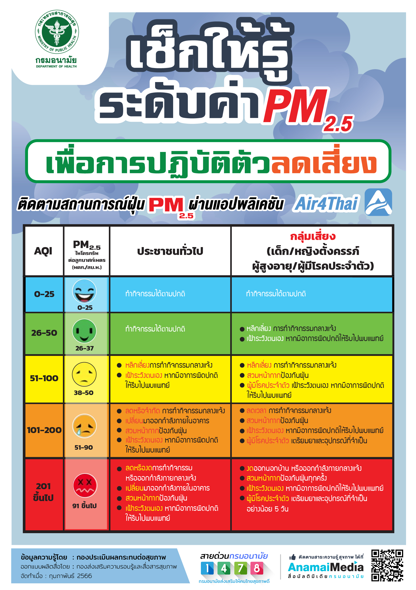
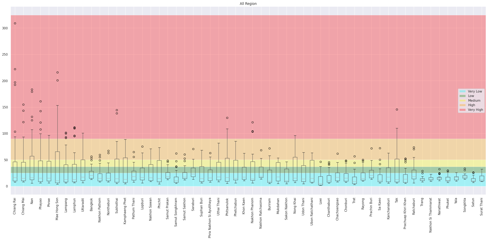
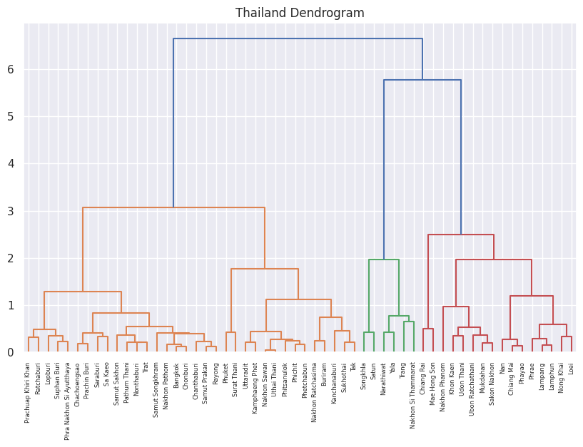
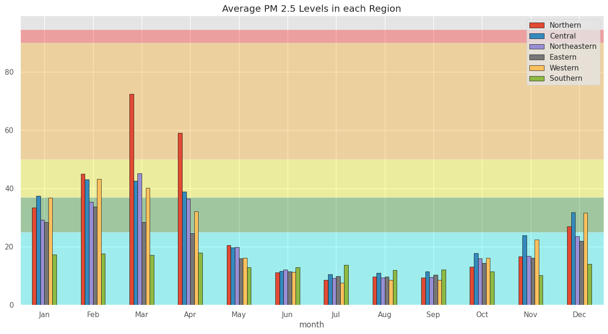
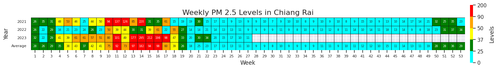
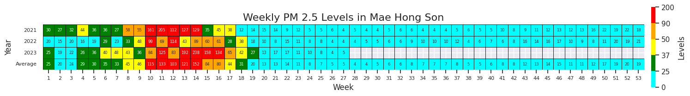
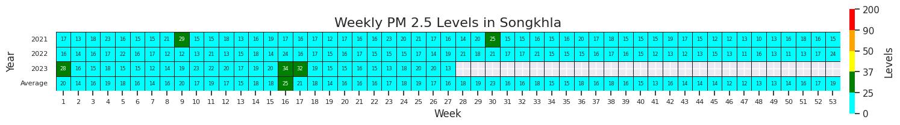
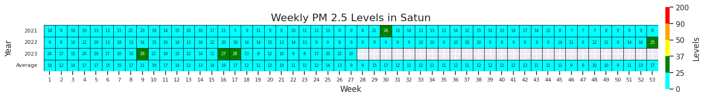
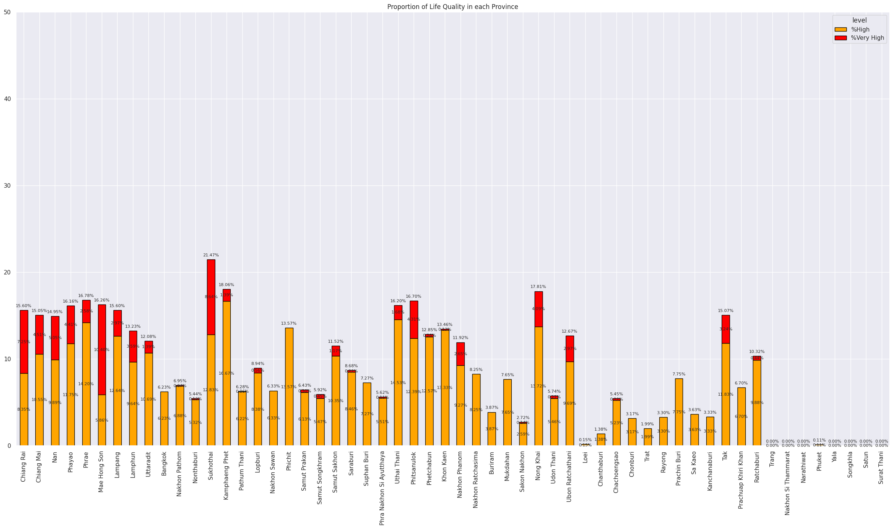

# การท่องเที่ยวให้ปลอดภัยจากฝุ่น PM 2.5 และสถานการณ์ฝุ่น
&nbsp;&nbsp;&nbsp;&nbsp; การท่องเที่ยวในปัจจุบันไม่เพียงแต่ต้องคำนึงถึงสถานที่และความปลอดภัยในด้านการเดินทางเท่านั้น แต่ยังต้องพิจารณาถึงคุณภาพอากาศ โดยเฉพาะมลพิษจากฝุ่น PM2.5 ซึ่งส่งผลกระทบอย่างมากต่อสุขภาพ ฝุ่น PM2.5 เป็นอนุภาคขนาดเล็กที่สามารถเข้าสู่ระบบทางเดินหายใจและก่อให้เกิดโรคต่างๆ เช่น โรคระบบทางเดินหายใจ หัวใจ และหลอดเลือด ดังนั้นเราจึงทำการศึกษาข้อมูลฝุ่น PM 2.5 ในประเทศไทย  เพื่อช่วยวางแผนการท่องเที่ยว การเดินทางได้ปลอดภัยขึ้น หลีกเลี่ยงพื้นที่ฝุ่นเยอะ ท่องเที่ยวได้อย่างสบายใจปลอดภัยและไม่ส่งผลกระทบต่อสุขภาพ

###  PM2.5 คืออะไร ทำไมถึงต้องกลัวและระวัง
&nbsp;&nbsp;&nbsp;&nbsp; จากข้อมูลของ กองโรคจากการประกอบอาชีพและสิ่งแวดล้อม กรมควบคุมโรค กระทรวงสาธารณสุข ได้ให้ความหมายของ PM2.5 ว่า เป็นฝุ่นที่มีเส้นผ่านศูนย์กลางไม่เกิน 2.5 ไมโครเมตร เกิดจากการเผาไหม้ ทั้งจากยานพาหนะ กระบวนการอุตสาหกรรม สามารถเข้าไปถึงถุงลมปอดได้ เป็นผลทำให้เกิดโรคระบบทางเดินหายใจ และโรคปอดต่าง ๆ หากได้รับในปริมาณมากหรือเป็นเวลานานจะสะสมในเนื้อเยื่อปอด ทำให้การทำงานของปอดเสื่อมประสิทธิภาพลง ทำให้หลอดลมอักเสบและมีอาการหอบหืด
### ฝุ่นเท่าไหร่เรียกว่าอันตราย!!!

### สถานการณ์ฝุ่นเป็นอย่างไรบ้างในปี 2018 ถึง 2023
&nbsp;&nbsp;&nbsp;&nbsp; จากข้อมูลที่ได้มา เราจะวิเคราะห์ค่าฝุ่น PM2.5 ในแต่ละจังหวัด โดยใช้ กราฟ Boxplot เพื่อแสดงการกระจายตัวของค่าฝุ่น ช่วยให้เห็นค่ากลาง (Median) และช่วงของค่าฝุ่นในแต่ละจังหวัด รวมถึงการระบุ Outliers ซึ่งเป็นค่าผิดปกติ การวิเคราะห์นี้จะช่วยให้เข้าใจสถานการณ์ฝุ่น PM2.5 ในแต่ละพื้นที่และสามารถเปรียบเทียบระหว่างจังหวัดได้

- ฝุ่น 50% แรก: 
ข้อมูลแสดงให้เห็นว่าค่าฝุ่น PM2.5 ในช่วง 50% แรกของแต่ละจังหวัดมีการกระจายตัวที่ค่อนข้างต่ำ โดยส่วนใหญ่ค่าเฉลี่ยของฝุ่นจะอยู่ในระดับที่ปลอดภัย (อยู่ในโซนสีฟ้าและสีเขียว ซึ่งเป็นระดับ Very Low ถึง Low)
- ฝุ่น 50% หลัง:
 ค่าฝุ่นในช่วง 50% หลังมีการกระจายตัวสูงขึ้นอย่างชัดเจน โดยเฉพาะในจังหวัดทางภาคเหนืออย่าง เชียงราย และ เชียงใหม่ ซึ่งฝุ่นในโซนนี้มีการกระจายตัวในระดับสูงมากและหลายค่าพุ่งเข้าสู่โซนสีส้มและสีแดง (ระดับ High และ Very High) ซึ่งเป็นสัญญาณของมลพิษที่รุนแรง

### วิเคราะห์เชิงลึกจาก Boxplot สู่การจับกลุ่ม Dendrogram
&nbsp;&nbsp;&nbsp;&nbsp;หลังจากที่เราได้เห็นการกระจายตัวของค่าฝุ่น PM2.5 ในแต่ละจังหวัดผ่านกราฟ Boxplot ซึ่งช่วยให้เราเข้าใจระดับฝุ่นในแต่ละพื้นที่ ตอนนี้เราจะมาดูการวิเคราะห์ในเชิงลึกต่อไป เพื่อให้เห็นภาพรวมของความคล้ายคลึงกันหรือความแตกต่างระหว่างจังหวัดต่างๆ ในเรื่องของค่าฝุ่น PM2.5 เราจะใช้กราฟ Dendrogram ในการแบ่งกลุ่มจังหวัดที่มีลักษณะค่าฝุ่นใกล้เคียงกัน กราฟนี้จะช่วยให้เราสามารถมองเห็นว่าจังหวัดไหนมีแนวโน้มคล้ายกันในแง่ของมลพิษทางอากาศ โดยแบ่งจังหวัดต่างๆ ออกเป็นกลุ่มๆ ตามความคล้ายคลึงกันของข้อมูล

&nbsp;&nbsp;&nbsp;&nbsp;การวิเคราะห์นี้จะทำให้เราสามารถระบุได้ชัดเจนขึ้นว่าภูมิภาคไหนมีสถานการณ์ฝุ่นที่คล้ายคลึงกัน และช่วยให้เราเข้าใจภาพรวมของมลพิษ PM2.5 ในประเทศไทยมากยิ่งขึ้น โดยกราฟ Dendrogram แสดงให้เห็นการจัดกลุ่มจังหวัดในประเทศไทยตามค่าฝุ่น PM2.5 โดยชี้ให้เห็นว่าจังหวัดในภาคเหนือ เช่น เชียงราย และ แม่ฮ่องสอน มีค่าฝุ่นสูงและถูกจัดกลุ่มร่วมกัน ซึ่งบ่งบอกถึงปัญหามลพิษทางอากาศที่รุนแรงในภูมิภาคนี้ ในทางตรงกันข้าม จังหวัดในภาคใต้และภาคตะวันออก เช่น สงขลา และ สตูล มีค่าฝุ่นต่ำกว่าอย่างชัดเจน แสดงถึงคุณภาพอากาศที่ดีขึ้น การแบ่งกลุ่มเหล่านี้ช่วยให้เรามองเห็นความแตกต่างทางมลพิษระหว่างภูมิภาค ช่วยให้เราสามารถวางแผนการเดินทางได้ดีขึ้น เช่นถ้าเราจะไปเที่ยวภาคเหนืออาจจะต้องมีการศึกษาเพิ่มเติมถึงเรื่องช่วงที่ปริมาณฝุ่นเยอะเพื่อหลีกเลี่ยงการเที่ยวในช่วงนั้น

### เจาะลึกค่าฝุ่น PM2.5 ในแต่ละภูมิภาค ภาคไหนฝุ่นพุ่ง ภาคไหนอากาศดี พร้อมวางแผนเที่ยวได้ตลอดปี!
หลังจากเห็นการจัดกลุ่มจังหวัดตามค่าฝุ่น PM2.5 ผ่าน Dendrogram แล้ว กราฟ Average PM2.5 Levels ในแต่ละภูมิภาคแสดงให้เห็นแนวโน้มค่าฝุ่นในแต่ละเดือนชัดเจน

- ภาคเหนือ มีค่าฝุ่นสูงสุดในช่วงต้นปี (มกราคม-เมษายน) เนื่องจากการเผาป่า  ค่าฝุ่นพุ่งเกิน 90 ไมโครกรัม/ลูกบาศก์เมตร

 (อ้างอิงข้อมูลจาก กรมอุทยานแห่งชาติ สัตว์ป่าเเละพันธุ์พืช ภาคเหนือ พื้นที่ 16 จังหวัด ระยะเวลา 10 ปี ตั้งแต่ 2556 – 2565 เกิดไฟไหม้ป่าทั้งหมด 36,030 ครั้ง พื้นที่ป่าถูกไฟไหม้ 612,435 ไร่ คิดเป็น 68.63% ของพื้นที่ป่าที่ถูกเผาไหม้ทั้งหมด) 
- ภาคใต้ และ ภาคตะวันออก มีอากาศบริสุทธิ์เกือบตลอดทั้งปี เหมาะกับการท่องเที่ยว
- ภูมิภาคอื่นๆ มีค่าฝุ่นปานกลาง โดยช่วงปลายปีอาจเพิ่มขึ้นบ้างแต่ยังอยู่ในระดับปลอดภัย

### ดูระดับค่าฝุ่น PM 2.5 รายสัปดาห์ผ่าน กราฟ Heatmap
&nbsp;&nbsp;&nbsp;&nbsp;หลังจากเห็นภาพรวมการจัดกลุ่มจังหวัดตามค่าฝุ่น PM2.5 ผ่านกราฟ Dendrogram แล้ว เรามาดูรายละเอียดเชิงลึกด้วยกราฟ Heatmap ที่แสดงการเปลี่ยนแปลงค่าฝุ่นรายสัปดาห์ในช่วงหลายปีที่ผ่านมา กราฟนี้จะช่วยให้เรามองเห็นช่วงเวลาที่ค่าฝุ่นพุ่งสูงและช่วงที่อากาศบริสุทธิ์ ซึ่งจะช่วยในการวางแผนการเดินทางหรือกิจกรรมต่างๆ ได้อย่างแม่นยำ พร้อมทั้งเฝ้าระวังสุขภาพในช่วงเวลาที่ค่าฝุ่นสูง  เราจะยกตัวอย่าง กราฟ Heatmap ที่แสดงค่าฝุ่น PM2.5 รายสัปดาห์สำหรับ 2 จังหวัดทางภาคเหนือ คือ เชียงใหม่ และ เชียงราย ซึ่งมักมีค่าฝุ่นสูง ขณะที่เราจะเปรียบเทียบกับ 2 จังหวัดในภาคใต้ ที่มีค่าฝุ่นต่ำ เช่น สงขลา และ ประจวบคีรีขันธ์ ที่มีอากาศบริสุทธิ์เกือบตลอดทั้งปี ทำให้ข้อมูลนี้เป็นตัวช่วยสำคัญในการวางแผนการเดินทางในแต่ละภูมิภาคอย่างปลอดภัยและเหมาะสม

&nbsp;&nbsp;&nbsp;&nbsp; กราฟ Heatmap นี้แสดงให้เห็นถึงระดับค่าฝุ่น PM 2.5 รายสัปดาห์ในแต่ละปี ซึ่งมีประโยชน์ในการวางแผนการเดินทางหรือกิจกรรมกลางแจ้ง โดยเฉพาะในจังหวัดที่มีความแตกต่างด้านคุณภาพอากาศในแต่ละช่วงเวลา
-  ข้อมูลนี้ช่วยให้สามารถเลือกช่วงเวลาเดินทางที่มีค่าฝุ่นต่ำ   อากาศที่บริสุทธิ์และปลอดภัยสำหรับการทำกิจกรรมกลางแจ้ง ตัวอย่างเช่น หากวางแผนเดินทางไปยังจังหวัด สงขลา ที่มีค่าฝุ่น PM 2.5 ต่ำตลอดทั้งปี  
-  นักท่องเที่ยวที่สนใจเดินทางไปยังภาคเหนือ เช่น  เชียงใหม่ หรือ เชียงราย  อาจสังเกตเห็นว่าค่าฝุ่น PM 2.5 มีแนวโน้มที่จะสูงขึ้นในบางช่วงของปี การดูข้อมูลจาก Heatmap สามารถช่วยให้หลีกเลี่ยงช่วงที่มีค่าฝุ่นสูงและเลือกช่วงเวลาที่อากาศบริสุทธิ์มากขึ้นแทน
-  การวางแผนกิจกรรมกลางแจ้ง ข้อมูลนี้เป็นตัวช่วยในการตัดสินใจว่าจะหลีกเลี่ยงการออกกำลังกายหรือทำกิจกรรมกลางแจ้งในช่วงเวลาที่ค่าฝุ่นสูงเกินไป เพื่อหลีกเลี่ยงผลกระทบต่อสุขภาพได้

### สัดส่วนความเข้มข้นของฝุ่น PM 2.5 ที่เป็นอันตราย

 

&nbsp;&nbsp;&nbsp;&nbsp; &nbsp;&nbsp;&nbsp;&nbsp;**_หากมองสัดส่วนความเข้มข้นของฝุ่น PM 2.5 ที่เป็นอันตรายตามจำนวนวันที่วัดในแต่ละจังหวัด ตั้งแต่ปี 2018 ถึง 2021 โดยสะท้อนถึงสภาพความเป็นอยู่ของผู้คนในแต่ละจังหวัด ในแง่ของสภาพแวดล้อมทางอากาศ_**
ตัวอย่างเช่น:
- จังหวัด **แม่ฮ่องสอน** มีสัดส่วนวันที่ค่าฝุ่น PM 2.5 อยู่ในระดับ **สูง** ที่ **5.86%** ซึ่งบ่งชี้ถึงวันที่คุณภาพอากาศเริ่มส่งผลกระทบต่อสุขภาพ
- นอกจากนี้ แม่ฮ่องสอนยังมีสัดส่วนวันที่ค่าฝุ่นอยู่ในระดับ **สูงมาก** ที่ **10.40%** ซึ่งแสดงถึงวันที่คุณภาพอากาศเป็นอันตรายต่อสุขภาพของทุกคน

&nbsp;&nbsp;&nbsp;&nbsp; &nbsp;&nbsp;&nbsp;&nbsp; ภาพรวมนี้แสดงให้เห็นถึงความแตกต่างของคุณภาพอากาศระหว่างจังหวัดต่างๆ หากคุณอาศัยอยู่ในจังหวัดที่มีสัดส่วนวันที่ฝุ่น PM 2.5 สูงในระดับอันตรายมาก คุณจะต้องเผชิญกับความเสี่ยงต่อสุขภาพที่มากกว่าเมื่อเทียบกับจังหวัดที่มีสัดส่วนต่ำ สัดส่วนเหล่านี้สะท้อนถึงสภาพแวดล้อมที่อาจส่งผลต่อคุณภาพชีวิตและสุขภาพของประชาชนในแต่ละพื้นที่อย่างชัดเจน

&nbsp;&nbsp;&nbsp;&nbsp; &nbsp;&nbsp;&nbsp;&nbsp; นอกจากนี้ยังแสดงให้เห็นถึงความแตกต่างอย่างชัดเจนระหว่างจังหวัดต่างๆ: จังหวัดที่มีสัดส่วนวันที่ฝุ่นอยู่ในระดับ สูง และ สูงมาก จำนวนมาก เช่น เชียงราย, เชียงใหม่ และน่าน แสดงว่าผู้ที่อาศัยอยู่ในจังหวัดเหล่านี้จะต้องเผชิญกับความเสี่ยงทางสุขภาพจากมลพิษทางอากาศมากกว่าจังหวัดที่มีสัดส่วนต่ำกว่าในขณะที่จังหวัดเช่น ระนอง, ภูเก็ต และสุราษฎร์ธานี แทบจะไม่มีวันที่ค่าฝุ่น PM 2.5 ขึ้นไปถึงระดับสูงมากเลย แสดงว่าผู้คนในพื้นที่เหล่านี้มีคุณภาพอากาศที่ดีกว่า และความเสี่ยงต่อสุขภาพที่เกี่ยวข้องกับฝุ่นละอองก็ต่ำกว่ามาก 

&nbsp;&nbsp;&nbsp;&nbsp; &nbsp;&nbsp;&nbsp;&nbsp; การมีสัดส่วนวันที่ฝุ่นสูงแตกต่างกันในแต่ละจังหวัด สะท้อนถึงสภาพแวดล้อมทางอากาศที่ไม่เท่ากันในแต่ละพื้นที่ ซึ่งอาจเกิดจากปัจจัยต่างๆ เช่น ลักษณะภูมิประเทศ, กิจกรรมอุตสาหกรรม หรือปัจจัยทางภูมิอากาศ การทำความเข้าใจความแตกต่างนี้ช่วยให้เราตระหนักถึงคุณภาพชีวิตและความเสี่ยงต่อสุขภาพของผู้คนในแต่ละพื้นที่ได้ดียิ่งขึ้น อีกทั้งยังช่วยในการวางแผนจัดการคุณภาพอากาศและลดผลกระทบต่อสุขภาพของประชาชนในระยะยาว

### Summary

### Our Challenge

### Data Set: ข้อมูลคุณภาพอากาศจากจุดตรวจวัดคุณภาพอากาศ จากกรมควบคุมมลพิษ
ข้อมูลฝุ่นละอองขนาดไม่เกิน 2.5 ไมครอน (PM2.5) รายวัน จำแนกรายสถานี (กรมควบคุมมลพิษทำการเก็บรวบรวมข้อมูลเป็นรายวันจากจุดตรวจวัดคุณภาพอากาศอัตโนมัติของกรมควบคุมมลพิษ ซึ่งกรมควบคุมมลพิษนำมาจัดทำรายงานเป็นรายปี)

URL: https://pcd.gdcatalog.go.th/it/dataset/air-quality-bangkok-metropolitan-region
