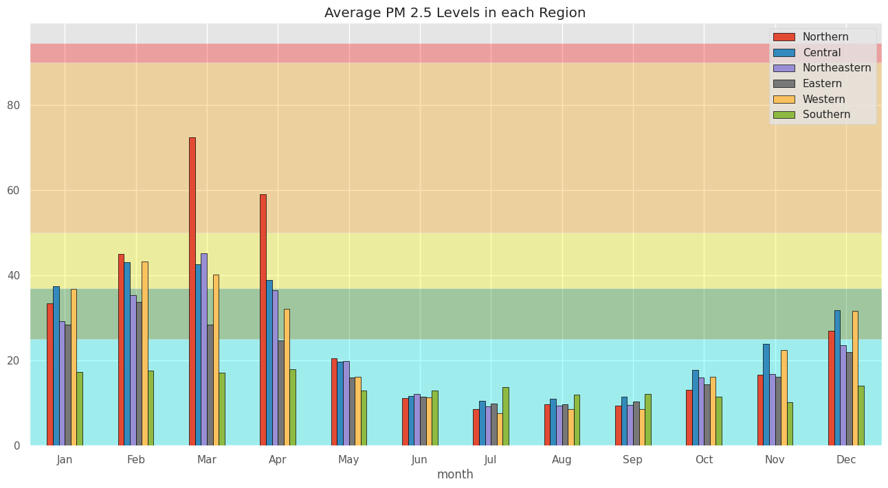
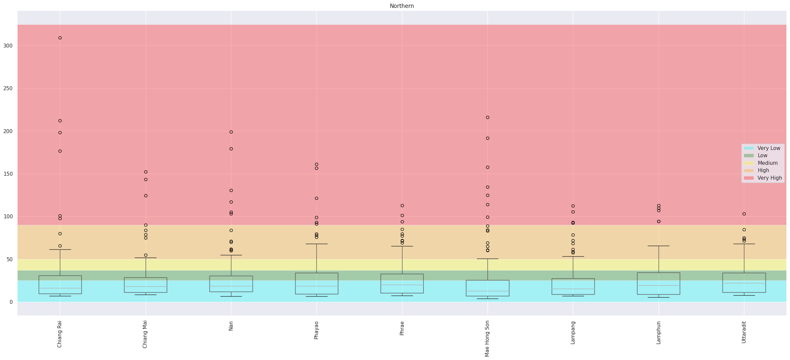

# การท่องเที่ยวให้ปลอดภัยจากฝุ่น PM 2.5 และสถานการณ์ฝุ่น
การท่องเที่ยวในปัจจุบันไม่เพียงแต่ต้องคำนึงถึงสถานที่และความปลอดภัยในด้านการเดินทางเท่านั้น แต่ยังต้องพิจารณาถึงคุณภาพอากาศ โดยเฉพาะมลพิษจากฝุ่น PM2.5 ซึ่งส่งผลกระทบอย่างมากต่อสุขภาพ ฝุ่น PM2.5 เป็นอนุภาคขนาดเล็กที่สามารถเข้าสู่ระบบทางเดินหายใจและก่อให้เกิดโรคต่างๆ เช่น โรคระบบทางเดินหายใจ หัวใจ และหลอดเลือด ดังนั้นเราจึงทำการศึกษาข้อมูลฝุ่น PM 2.5 ในประเทศไทย  เพื่อช่วยวางแผนการท่องเที่ยว การเดินทางได้ปลอดภัยขึ้น หลีกเลี่ยงพื้นที่ฝุ่นเยอะ ท่องเที่ยวได้อย่างสบายใจปลอดภัยและไม่ส่งผลกระทบต่อสุขภาพ

### Data Set: ข้อมูลคุณภาพอากาศจากจุดตรวจวัดคุณภาพอากาศ จากกรมควบคุมมลพิษ
ข้อมูลฝุ่นละอองขนาดไม่เกิน 2.5 ไมครอน (PM2.5) รายวัน จำแนกรายสถานี (กรมควบคุมมลพิษทำการเก็บรวบรวมข้อมูลเป็นรายวันจากจุดตรวจวัดคุณภาพอากาศอัตโนมัติของกรมควบคุมมลพิษ ซึ่งกรมควบคุมมลพิษนำมาจัดทำรายงานเป็นรายปี)

URL: https://pcd.gdcatalog.go.th/it/dataset/air-quality-bangkok-metropolitan-region

#### Part 1: สถานการณ์ฝุ่นตั้งแต่อดีต - ปัจจุบัน (2018-2023) ของในประเทศ  
 จากข้อมูลที่ได้มา เราจะวิเคราะห์ค่าฝุ่น PM2.5 ในแต่ละจังหวัด โดยใช้ กราฟ Boxplot เพื่อแสดงการกระจายตัวของค่าฝุ่น ช่วยให้เห็นค่ากลาง (Median) และช่วงของค่าฝุ่นในแต่ละจังหวัด รวมถึงการระบุ Outliers ซึ่งเป็นค่าผิดปกติ การวิเคราะห์นี้จะช่วยให้เข้าใจสถานการณ์ฝุ่น PM2.5 ในแต่ละพื้นที่และสามารถเปรียบเทียบระหว่างจังหวัดได้

จากกราฟ Boxplot มีการแบ่งสีเพื่อช่วยในการระบุระดับของค่าฝุ่นตามมาตรฐานต่าง ๆ ตั้งแต่ Very Low ไปจนถึง Very High ซึ่งช่วยให้เราเข้าใจสถานการณ์มลพิษในแต่ละจังหวัดได้ชัดเจนยิ่งขึ้น โดยข้อมูลที่น่าสนใจจากกราฟมีดังนี้ ซึ่งจังหวัดในภาคเหนือมี outlier ที่ปรากฏชัดเจนในสีแดง โดยที่่ จังหวัดเชียงรายและเชียงใหม่ ทั้งสองจังหวัดนี้มีค่าฝุ่น PM2.5 ที่ค่อนข้างสูงและมี outlier จำนวนมากที่พุ่งขึ้นไปถึงระดับที่ถือว่าสูงมาก (Very High) ซึ่งเป็นสีแดง ในช่วงบางวัน ค่าฝุ่นสามารถพุ่งสูงถึงเกิน 300 ไมโครกรัม/ลูกบาศก์เมตร ซึ่งถือว่าเป็นอันตรายต่อสุขภาพอย่างมาก

#### จากข้อมูล Boxplot เราจะเห็นว่าจังหวัดส่วนใหญ่ที่มี outlier สูงมากจะอยู่ที่ภาคเหนือ ดังนั้นเราจะมาดูข้อมูลแยกเป็นภูมิภาคเพื่อให้เห็นความชัดเจนมากขึ้น

#### Part 2: วิเคราะห์ความสัมพันธ์ของปริมาณฝุ่น PM2.5 ระหว่างจังหวัดต่าง ๆ

เพื่อดูว่าค่าฝุ่น PM2.5 ในจังหวัดหนึ่งมีความสัมพันธ์กับจังหวัดอื่นๆ อย่างไร การวิเคราะห์นี้จะช่วยบ่งบอกว่าจังหวัดใดมีการเคลื่อนตัวของฝุ่นไปยังจังหวัดข้างเคียง หรือได้รับผลกระทบจากแหล่งกำเนิดฝุ่นในบริเวณใกล้เคียงมากน้อยแค่ไหน
จังหวัดที่อยู่ใกล้เคียงกัน เช่น เชียงใหม่และลำปาง อาจมีค่าความสัมพันธ์เชิงบวกสูง เนื่องจากมีสาเหตุของการเกิดฝุ่นที่คล้ายคลึงกัน เช่น การเผาในที่โล่งในภาคเหนือ
จังหวัดที่อยู่ไกลจากกัน เช่น กรุงเทพฯ และภูเก็ต อาจมีค่าความสัมพันธ์ต่ำกว่า เนื่องจากปัจจัยการเกิดฝุ่นมาจากสาเหตุที่แตกต่างกัน เช่น การจราจรในเมืองใหญ่กับฝุ่นควันจากเรือในพื้นที่ชายฝั่ง

#### Part 3:  สถานการณ์ฝุ่นแต่ละภาค
สถานการณ์ฝุ่น PM2.5 ในแต่ละภาคของประเทศไทยมีความแตกต่างกันขึ้นอยู่กับลักษณะภูมิประเทศ กิจกรรมทางเศรษฐกิจ การขนส่ง และสภาพอากาศของแต่ละภาค ซึ่งสามารถสรุปสถานการณ์ฝุ่นในแต่ละภาคได้ดังนี้

#### Part 4: Top 5 high PM 2.5 provinces
จากการวิเคราะห์ข้อมูลปริมาณฝุ่น PM2.5 ในช่วงปี 2018-2023 พบว่ามี 5 จังหวัดในประเทศไทยที่ประสบปัญหาค่าฝุ่น PM2.5 สูงที่สุดเป็นประจำทุกปี จังหวัดเหล่านี้ล้วนเป็นพื้นที่ที่มีปัจจัยต่างๆ เช่น การเผาในที่โล่ง อุตสาหกรรม และการจราจรที่หนาแน่น ซึ่งทำให้ค่าฝุ่นสะสมอยู่ในระดับที่เป็นอันตรายต่อสุขภาพของประชาชน โดย 5 จังหวัดที่มีปริมาณฝุ่น PM2.5 สูงสุดได้แก่
Part 5:  คาดการณ์สถานการณ์ ฝุ่น ในอนาคต for top 5 province

### Summary

### Our Challenge
