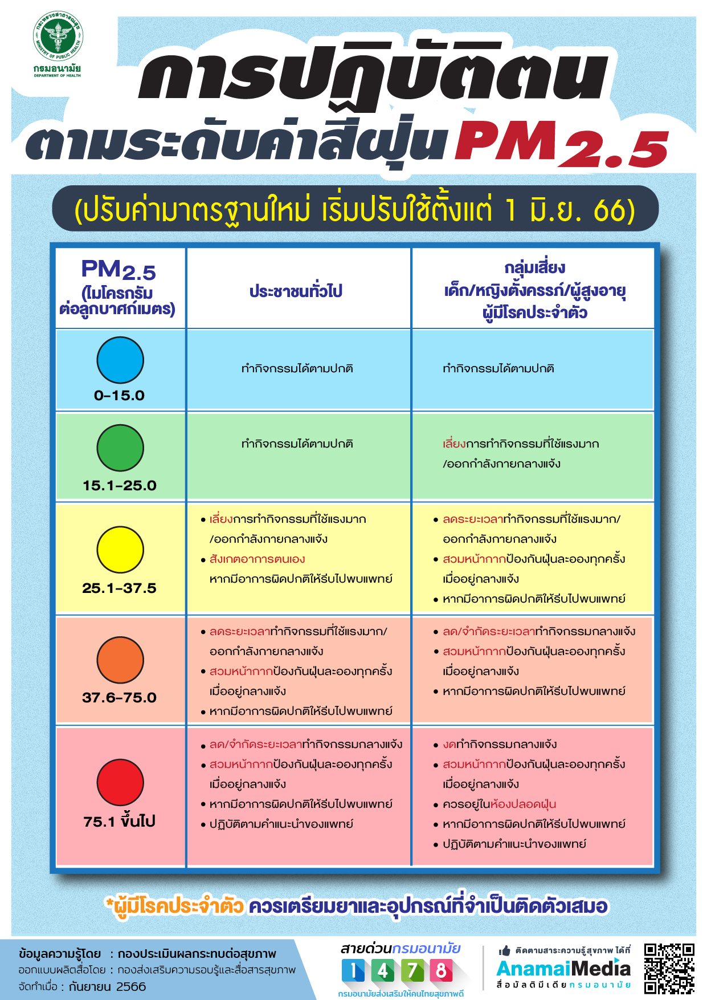
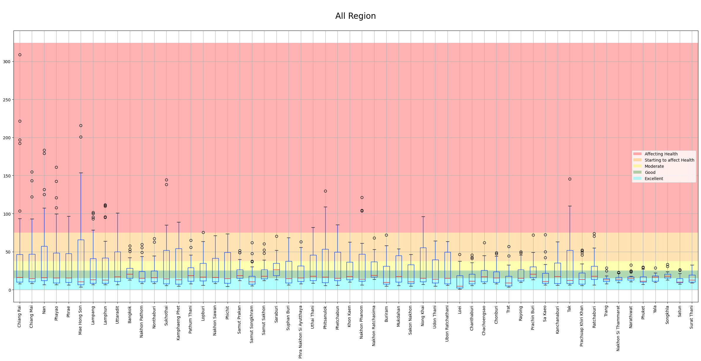
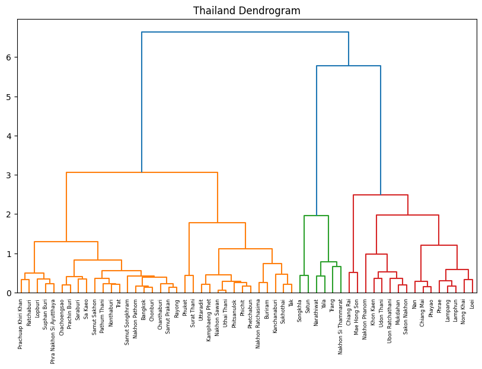
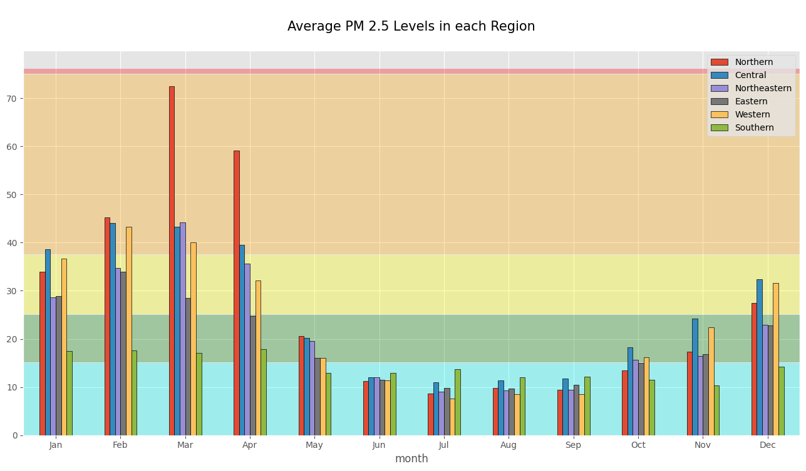
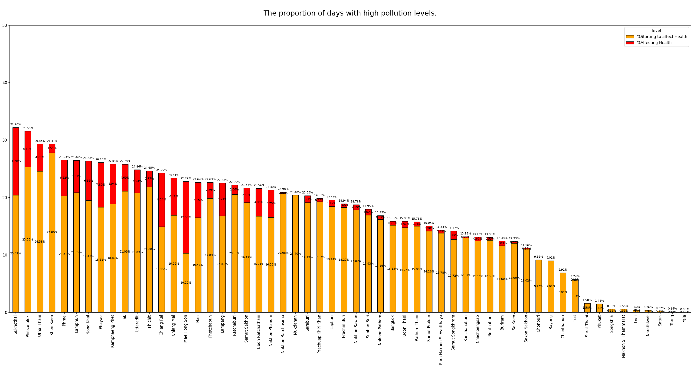

# ตะลุยเที่ยวทั่วไทย ในวันที่ไร้ฝุ่น PM 2.5
&nbsp;&nbsp;&nbsp;&nbsp; การท่องเที่ยวในยุคปัจจุบัน ไม่ได้มุ่งเน้นเพียงการเลือกสถานที่สวยงามหรือการเดินทางที่ปลอดภัยเท่านั้น แต่การพิจารณาถึง คุณภาพอากาศ ควรกลายเป็นปัจจัยสำคัญที่เราควรนำพิจารณา โดยเฉพาะมลพิษทางอากาศจาก ฝุ่น PM2.5 ที่เป็นภัยเงียบและส่งผลกระทบต่อสุขภาพอย่างรุนแรง

###  PM2.5 คืออะไร ทำไมถึงต้องกลัวและระวัง
&nbsp;&nbsp;&nbsp;&nbsp; จากข้อมูลของ กรมควบคุมโรค กระทรวงสาธารณสุข ได้ให้ความหมายของ PM2.5 ว่า เป็นฝุ่นที่มีเส้นผ่านศูนย์กลางไม่เกิน 2.5 ไมโครเมตร เกิดจากการเผาไหม้ สามารถเข้าไปถึงถุงลมปอดได้ เป็นผลทำให้เกิดโรคระบบทางเดินหายใจ และโรคปอดต่าง ๆ หากได้รับในปริมาณมากหรือเป็นเวลานานจะสะสมในเนื้อเยื่อปอด ทำให้การทำงานของปอดเสื่อมประสิทธิภาพลง ทำให้หลอดลมอักเสบและมีอาการหอบหืด
### ฝุ่นเท่าไหร่เรียกว่าอันตราย!!!

### สถานการณ์ฝุ่นเป็นอย่างไรบ้างในปี 2018 ถึง 2023
&nbsp;&nbsp;&nbsp;&nbsp; จากข้อมูลที่ได้มา เราจะวิเคราะห์ค่าฝุ่น PM2.5 ในแต่ละจังหวัด โดยใช้ กราฟ Boxplot เพื่อแสดงการกระจายตัวของค่าฝุ่น ช่วยให้เห็นค่ากลาง (Median) และช่วงของค่าฝุ่นในแต่ละจังหวัด รวมถึงการระบุ Outliers ซึ่งเป็นค่าผิดปกติ การวิเคราะห์นี้จะช่วยให้เข้าใจสถานการณ์ฝุ่น PM2.5 ในแต่ละพื้นที่และสามารถเปรียบเทียบระหว่างจังหวัดได้

จากการวิเคราะห์กราฟ Boxplot พบว่า:

- 50% แรก ของค่าฝุ่น PM2.5 ในหลายจังหวัดกระจายตัวอยู่ในระดับที่ไม่ส่งผลกระทบต่อสุขภาพ โดยเฉพาะจังหวัดในภาคใต้และภาคตะวันออก เช่น สุราษฎร์ธานี, สงขลา และ ภูเก็ต ค่าฝุ่นส่วนใหญ่อยู่ในระดับดี (สีฟ้าและสีเขียว) ซึ่งบ่งบอกถึงคุณภาพอากาศที่ดีและปลอดภัย
- 50% หลัง แสดงให้เห็นว่าจังหวัดทางภาคเหนือ เช่น เชียงราย, เชียงใหม่ และแม่ฮ่องสอน  โดยมีค่าฝุ่น PM2.5 Outliers ที่พุ่งเกิน 150 ไมโครกรัม/ลูกบาศก์เมตร ซึ่งอยู่ในระดับอันตรายต่อสุขภาพ

### วิเคราะห์เชิงลึกจาก Boxplot สู่การจับกลุ่ม Dendrogram
&nbsp;&nbsp;&nbsp;&nbsp;หลังจากที่เราได้เห็นการกระจายตัวของค่าฝุ่น PM2.5 ในแต่ละจังหวัดผ่านกราฟ Boxplot ซึ่งช่วยให้เราเข้าใจระดับฝุ่นในแต่ละพื้นที่ ตอนนี้เราจะมาดูการวิเคราะห์ในเชิงลึกต่อไป เพื่อให้เห็นภาพรวมของความคล้ายคลึงกันหรือความแตกต่างระหว่างจังหวัดต่างๆ ในเรื่องของค่าฝุ่น PM2.5 เราจะใช้กราฟ Dendrogram ในการแบ่งกลุ่มจังหวัดที่มีลักษณะค่าฝุ่นใกล้เคียงกัน กราฟนี้จะช่วยให้เราสามารถมองเห็นว่าจังหวัดไหนมีแนวโน้มคล้ายกันในแง่ของมลพิษทางอากาศ โดยแบ่งจังหวัดต่างๆ ออกเป็นกลุ่มๆ ตามความคล้ายคลึงกันของข้อมูล

&nbsp;&nbsp;&nbsp;&nbsp;การวิเคราะห์นี้จะทำให้เราสามารถระบุได้ชัดเจนขึ้นว่าภูมิภาคไหนมีสถานการณ์ฝุ่นที่คล้ายคลึงกัน และช่วยให้เราเข้าใจภาพรวมของมลพิษ PM2.5 ในประเทศไทยมากยิ่งขึ้น โดยกราฟ Dendrogram แสดงให้เห็นการจัดกลุ่มจังหวัดในประเทศไทยตามค่าฝุ่น PM2.5 โดยชี้ให้เห็นว่าจังหวัดในภาคเหนือ เช่น เชียงราย และ แม่ฮ่องสอน มีค่าฝุ่นสูงและถูกจัดกลุ่มร่วมกัน ซึ่งบ่งบอกถึงปัญหามลพิษทางอากาศที่รุนแรงในภูมิภาคนี้ ในทางตรงกันข้าม จังหวัดในภาคใต้และภาคตะวันออก เช่น สงขลา และ สตูล มีค่าฝุ่นต่ำกว่าอย่างชัดเจน แสดงถึงคุณภาพอากาศที่ดีขึ้น การจัดกลุ่มช่วยให้เราสามารถตัดสินใจเลือกจังหวัดที่มีอากาศดี และหลีกเลี่ยงจังหวัดที่มีปัญหาฝุ่นสูงได้ง่ายขึ้น เช่น หากเราต้องการไปท่องเที่ยวในช่วงที่ฝุ่นสูง เราอาจเลือกกลุ่มจังหวัดที่ค่าฝุ่นต่ำ เช่น ภาคใต้หรือภาคตะวันออก

### เจาะลึกค่าฝุ่น PM2.5 ในแต่ละภูมิภาค ภาคไหนฝุ่นพุ่ง ภาคไหนอากาศดี พร้อมวางแผนเที่ยวได้ตลอดปี!
&nbsp;&nbsp;&nbsp;&nbsp;หลังจากเห็นการจัดกลุ่มจังหวัดตามค่าฝุ่น PM2.5 ผ่าน Dendrogram แล้ว กราฟ Average PM2.5 Levels ในแต่ละภูมิภาคแสดงให้เห็นแนวโน้มค่าฝุ่นในแต่ละเดือนชัดเจนมากขึ้น ซึ่งเป็นข้อมูลที่มีประโยชน์สำหรับการวางแผนการท่องเที่ยวในแต่ละช่วงเวลา มาดูกันว่าภาคไหนฝุ่นพุ่งสูง ภาคไหนอากาศดีน่าเที่ยวกันบ้าง

 

 1. ภาคเหนือ: ช่วงฝุ่นพุ่งสูงสุดในต้นปี
ภาคเหนือ มีค่าฝุ่น PM2.5 สูงมากในช่วงเดือน มกราคมถึงเมษายน สาเหตุหลักมาจากการเผาป่าที่ส่งผลให้ค่าฝุ่นพุ่งทะลุเกิน 90 ไมโครกรัม/ลูกบาศก์เมตร ซึ่งถือว่าเป็นระดับที่มีผลกระทบต่อสุขภาพอย่างมาก
- อ้างอิงจากข้อมูลของกรมอุทยานแห่งชาติ สัตว์ป่า และพันธุ์พืช พบว่าในระยะเวลา 10 ปี (2556-2565) ภาคเหนือมีเหตุการณ์ไฟไหม้ป่าถึง 36,030 ครั้ง ครอบคลุมพื้นที่กว่า 612,435 ไร่ คิดเป็น 68.63% ของพื้นที่ป่าที่ถูกเผาทั่วประเทศ นี่จึงเป็นเหตุผลหลักที่ทำให้ค่าฝุ่นในภาคเหนือสูงในช่วงเวลาดังกล่าว
 2. ภาคใต้และภาคตะวันออก: อากาศดีเกือบตลอดปี
สำหรับนักท่องเที่ยวที่ต้องการหนีฝุ่นและมองหาที่เที่ยวที่มีอากาศบริสุทธิ์ ภาคใต้ และ ภาคตะวันออก เป็นตัวเลือกที่ดี เพราะมีค่าฝุ่น PM2.5 ต่ำเกือบตลอดทั้งปี โดยเฉพาะในช่วงที่ภาคเหนือมีปัญหาฝุ่นสูง ภาคเหล่านี้ยังคงมีค่าฝุ่นต่ำกว่า 30 ไมโครกรัม/ลูกบาศก์เมตร ซึ่งถือว่าอยู่ในระดับปลอดภัยและเหมาะสำหรับการท่องเที่ยวทั้งทะเลและธรรมชาติ
 3. ภูมิภาคอื่นๆ: ฝุ่นปานกลาง แต่ยังปลอดภัย
ภาคกลาง และ ภาคตะวันออกเฉียงเหนือ มีค่าฝุ่น PM2.5 อยู่ในระดับปานกลาง โดยส่วนใหญ่ยังคงปลอดภัย แต่ในบางเดือน เช่น ปลายปี ค่าฝุ่นอาจเพิ่มขึ้นบ้าง แต่ยังคงไม่เกินค่ามาตรฐานที่มีผลกระทบต่อสุขภาพ ภาคเหล่านี้ มีอากาศค่อนข้างบริสุทธิ์ในช่วงกลางปี ทำให้สามารถวางแผนท่องเที่ยวได้ในหลากหลายช่วงเวลา

### ดูระดับค่าฝุ่น PM 2.5 รายสัปดาห์ผ่าน กราฟ Heatmap
&nbsp;&nbsp;&nbsp;&nbsp;หลังจากเห็นภาพรวมการจัดกลุ่มจังหวัดตามค่าฝุ่น PM2.5 ผ่านกราฟ Dendrogram และเห็นค่าเฉลี่ยฝุ่รายเดือนผ่านกราฟ Bar chart เรามาดูรายละเอียดเชิงลึกด้วยกราฟ Heatmap ที่แสดงการเปลี่ยนแปลงค่าฝุ่นรายสัปดาห์ในช่วงหลายปีที่ผ่านมา กราฟนี้จะช่วยให้เรามองเห็นช่วงเวลาที่ค่าฝุ่นพุ่งสูงและช่วงที่อากาศบริสุทธิ์ ซึ่งจะช่วยในการวางแผนการเดินทางหรือกิจกรรมต่างๆ ได้อย่างแม่นยำ พร้อมทั้งเฝ้าระวังสุขภาพในช่วงเวลาที่ค่าฝุ่นสูง  เราจะยกตัวอย่าง กราฟ Heatmap ที่แสดงค่าฝุ่น PM2.5 รายสัปดาห์สำหรับ 2 จังหวัดทางภาคเหนือ คือ เชียงใหม่ และ เชียงราย ซึ่งมักมีค่าฝุ่นสูง ขณะที่เราจะเปรียบเทียบกับ 2 จังหวัดในภาคใต้ ที่มีค่าฝุ่นต่ำ เช่น สงขลา และ ประจวบคีรีขันธ์ ที่มีอากาศบริสุทธิ์เกือบตลอดทั้งปี ทำให้ข้อมูลนี้เป็นตัวช่วยสำคัญในการวางแผนการเดินทางในแต่ละภูมิภาคอย่างปลอดภัยและเหมาะสม

&nbsp;&nbsp;&nbsp;&nbsp; กราฟ Heatmap นี้แสดงให้เห็นถึงระดับค่าฝุ่น PM 2.5 รายสัปดาห์ในแต่ละปี ซึ่งมีประโยชน์ในการวางแผนการเดินทางหรือกิจกรรมกลางแจ้ง โดยเฉพาะในจังหวัดที่มีความแตกต่างด้านคุณภาพอากาศในแต่ละช่วงเวลา
-  ข้อมูลนี้ช่วยให้สามารถเลือกช่วงเวลาเดินทางที่มีค่าฝุ่นต่ำ   อากาศที่บริสุทธิ์และปลอดภัยสำหรับการทำกิจกรรมกลางแจ้ง ตัวอย่างเช่น หากวางแผนเดินทางไปยังจังหวัด สงขลา ที่มีค่าฝุ่น PM 2.5 ต่ำตลอดทั้งปี  
-  นักท่องเที่ยวที่สนใจเดินทางไปยังภาคเหนือ เช่น  เชียงใหม่ หรือ เชียงราย  อาจสังเกตเห็นว่าค่าฝุ่น PM 2.5 มีแนวโน้มที่จะสูงขึ้นในบางช่วงของปี การดูข้อมูลจาก Heatmap สามารถช่วยให้หลีกเลี่ยงช่วงที่มีค่าฝุ่นสูงและเลือกช่วงเวลาที่อากาศบริสุทธิ์มากขึ้นแทน
-  การวางแผนกิจกรรมกลางแจ้ง ข้อมูลนี้เป็นตัวช่วยในการตัดสินใจว่าจะหลีกเลี่ยงการออกกำลังกายหรือทำกิจกรรมกลางแจ้งในช่วงเวลาที่ค่าฝุ่นสูงเกินไป เพื่อหลีกเลี่ยงผลกระทบต่อสุขภาพได้

### อยู่เชียงใหม่ทั้งปี คุณสูดมลพิษไปกี่วัน (สัดส่วนความเข้มข้นของฝุ่น PM 2.5 ที่เป็นอันตราย)

 
&nbsp;&nbsp;&nbsp;&nbsp; ลองคิดดูว่าถ้าคุณอาศัยอยู่ในพื้นที่ที่มีค่าฝุ่นสูงมากๆตลอดทั้งปี 365 วันเลยจะเป็นอย่างไร ???? หากมองสัดส่วนความเข้มข้นของฝุ่น PM 2.5 ที่เป็นอันตรายตามจำนวนวันที่วัดในแต่ละจังหวัดตั้งแต่ปี 2018 ถึง 2021 โดยสะท้อนถึงสภาพความเป็นอยู่ของผู้คนในแต่ละจังหวัดในแง่ของสภาพแวดล้อมทางอากาศโดยข้อมูลนี้เป็นสัดส่วนจำนวนวันที่แสดงให้เห็นข้อมูลค่าฝุ่นที่อยู่ในระดับเป็นอันตราย เช่น จังหวัดเชียงใหม่ มีสัดส่วนวันที่ค่าฝุ่น PM 2.5 อยู่ในระดับ สูง ที่ 10.55% ซึ่งบ่งชี้ถึงวันที่คุณภาพอากาศเริ่มส่งผลกระทบต่อสุขภาพ และมีสัดส่วนวันที่ค่าฝุ่นแยกถึงระดับอันตรายถึงที่ 4.51% ซึ่งแสดงถึงวันที่คุณภาพอากาศเป็นอันตรายต่อสุขภาพของทุกคน
-  ภาพรวมนี้แสดงให้เห็นถึงความแตกต่างของคุณภาพอากาศระหว่างจังหวัดต่างๆ หากคุณอาศัยอยู่ในจังหวัดที่มีสัดส่วนวันที่ฝุ่น PM 2.5 สูงในระดับอันตรายมากเป็นระยะเวลานานหลายปีคุณจะต้องเผชิญกับความเสี่ยงต่อสุขภาพที่มากกว่าเมื่อเทียบกับจังหวัดที่มีสัดส่วนต่ำ สัดส่วนเหล่านี้สะท้อนถึงสภาพแวดล้อมที่อาจส่งผลต่อคุณภาพชีวิตและสุขภาพของประชาชนในแต่ละพื้นที่อย่างชัดเจน   
-  นอกจากนี้ยังแสดงให้เห็นถึงความแตกต่างอย่างชัดเจนระหว่างจังหวัดต่างๆ จังหวัดที่มีสัดส่วนวันที่ฝุ่นอยู่ในระดับ สูง และสูงมาก เช่น เชียงราย, เชียงใหม่ และน่าน แสดงว่าผู้ที่อาศัยอยู่ในจังหวัดเหล่านี้จะต้องเผชิญกับความเสี่ยงทางสุขภาพจากมลพิษทางอากาศมากกว่าจังหวัดที่มีสัดส่วนต่ำกว่าในขณะที่จังหวัดเช่น ระนอง, ภูเก็ต และสุราษฎร์ธานีแทบจะไม่มีวันที่ค่าฝุ่น PM 2.5 ขึ้นไปถึงระดับสูงมากเลยแสดงว่าผู้คนในพื้นที่เหล่านี้มีคุณภาพอากาศที่ดีกว่า และความเสี่ยงต่อสุขภาพที่เกี่ยวข้องกับฝุ่นละอองก็ต่ำกว่ามาก

&nbsp;&nbsp;&nbsp;&nbsp;การมีสัดส่วนวันที่ฝุ่นสูงแตกต่างกันในแต่ละจังหวัด สะท้อนถึงสภาพแวดล้อมทางอากาศที่ไม่เท่ากันในแต่ละพื้นที่ซึ่งอาจเกิดจากปัจจัยต่างๆ เช่น ลักษณะภูมิประเทศ, กิจกรรมอุตสาหกรรม หรือปัจจัยทางภูมิอากาศ การทำความเข้าใจความแตกต่างนี้ช่วยให้เราตระหนักถึงคุณภาพชีวิตและความเสี่ยงต่อสุขภาพของผู้คนในแต่ละพื้นที่ได้ดียิ่งขึ้น อีกทั้งยังช่วยในการวางแผนจัดการคุณภาพอากาศและลดผลกระทบต่อสุขภาพของประชาชนในระยะยาว

### Summary

### Our Challenge

### Data Set: ข้อมูลคุณภาพอากาศจากจุดตรวจวัดคุณภาพอากาศ จากกรมควบคุมมลพิษ
ข้อมูลฝุ่นละอองขนาดไม่เกิน 2.5 ไมครอน (PM2.5) รายวัน จำแนกรายสถานี (กรมควบคุมมลพิษทำการเก็บรวบรวมข้อมูลเป็นรายวันจากจุดตรวจวัดคุณภาพอากาศอัตโนมัติของกรมควบคุมมลพิษ ซึ่งกรมควบคุมมลพิษนำมาจัดทำรายงานเป็นรายปี)

URL: https://pcd.gdcatalog.go.th/it/dataset/air-quality-bangkok-metropolitan-region
