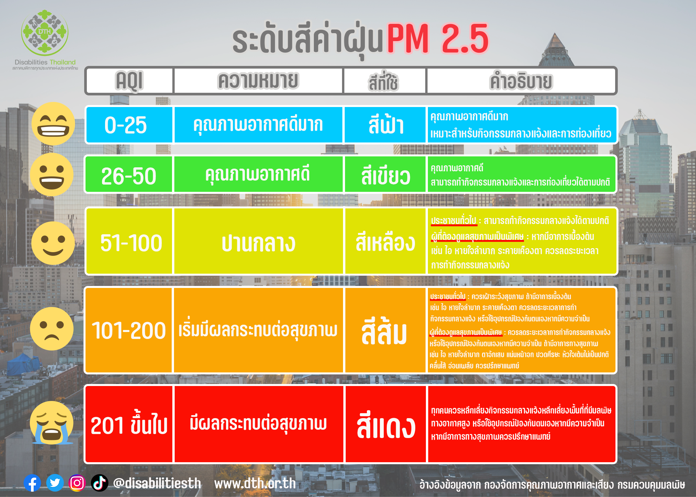
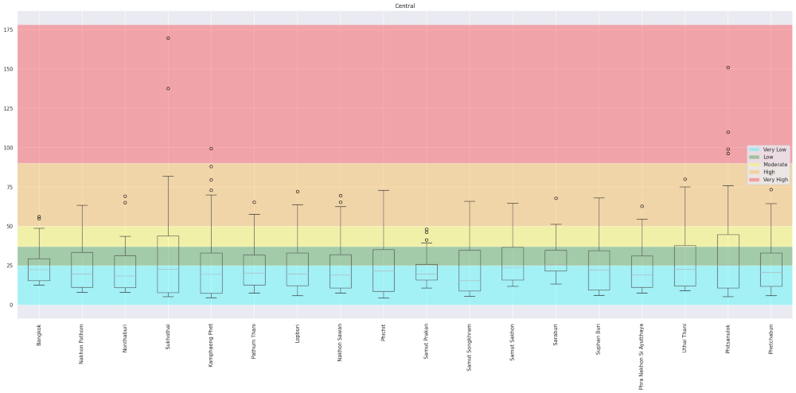
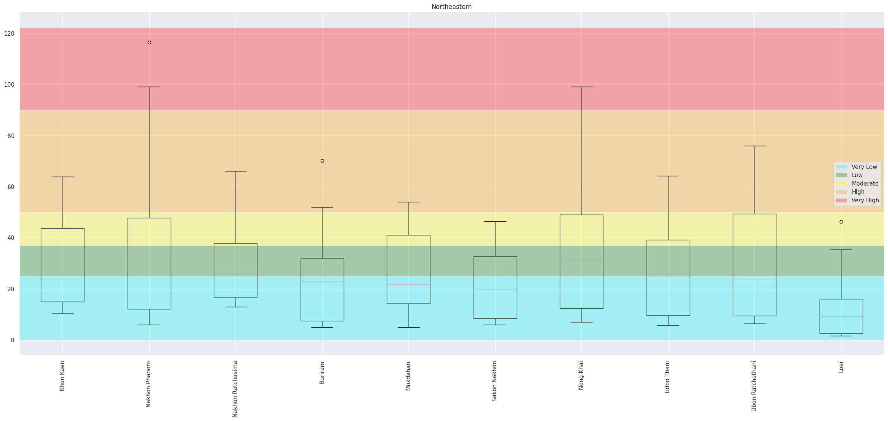
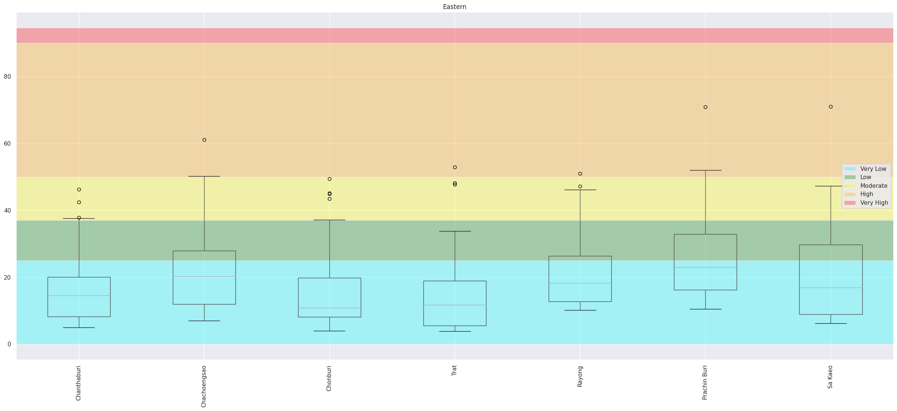
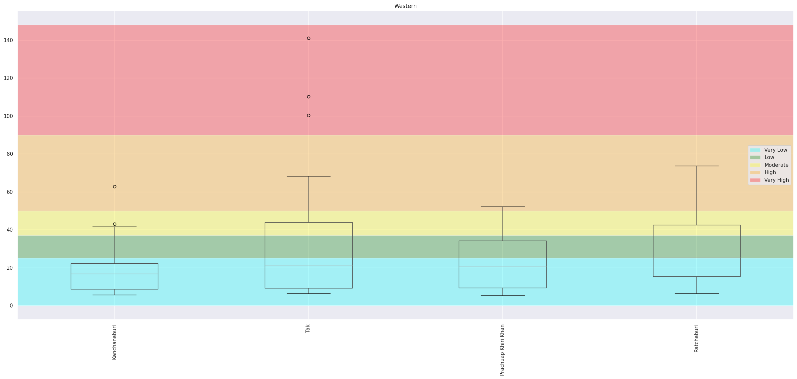
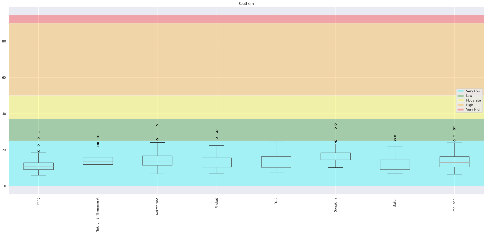

# การท่องเที่ยวให้ปลอดภัยจากฝุ่น PM 2.5 และสถานการณ์ฝุ่น
&nbsp;&nbsp;&nbsp;&nbsp; การท่องเที่ยวในปัจจุบันไม่เพียงแต่ต้องคำนึงถึงสถานที่และความปลอดภัยในด้านการเดินทางเท่านั้น แต่ยังต้องพิจารณาถึงคุณภาพอากาศ โดยเฉพาะมลพิษจากฝุ่น PM2.5 ซึ่งส่งผลกระทบอย่างมากต่อสุขภาพ ฝุ่น PM2.5 เป็นอนุภาคขนาดเล็กที่สามารถเข้าสู่ระบบทางเดินหายใจและก่อให้เกิดโรคต่างๆ เช่น โรคระบบทางเดินหายใจ หัวใจ และหลอดเลือด ดังนั้นเราจึงทำการศึกษาข้อมูลฝุ่น PM 2.5 ในประเทศไทย  เพื่อช่วยวางแผนการท่องเที่ยว การเดินทางได้ปลอดภัยขึ้น หลีกเลี่ยงพื้นที่ฝุ่นเยอะ ท่องเที่ยวได้อย่างสบายใจปลอดภัยและไม่ส่งผลกระทบต่อสุขภาพ

####  PM2.5 คืออะไร ทำไมถึงต้องกลัวและระวัง
&nbsp;&nbsp;&nbsp;&nbsp; จากข้อมูลของ กองโรคจากการประกอบอาชีพและสิ่งแวดล้อม กรมควบคุมโรค กระทรวงสาธารณสุข ได้ให้ความหมายของ PM2.5 ว่า เป็นฝุ่นที่มีเส้นผ่านศูนย์กลางไม่เกิน 2.5 ไมโครเมตร เกิดจากการเผาไหม้ ทั้งจากยานพาหนะ กระบวนการอุตสาหกรรม สามารถเข้าไปถึงถุงลมปอดได้ เป็นผลทำให้เกิดโรคระบบทางเดินหายใจ และโรคปอดต่าง ๆ หากได้รับในปริมาณมากหรือเป็นเวลานานจะสะสมในเนื้อเยื่อปอด ทำให้การทำงานของปอดเสื่อมประสิทธิภาพลง ทำให้หลอดลมอักเสบและมีอาการหอบหืด
#### ฝุ่นเท่าไหร่เรียกว่าอันตราย!!!

#### สถานการณ์ฝุ่นเป็นอย่างไรบ้างในปี 2018 ถึง 2023
&nbsp;&nbsp;&nbsp;&nbsp; จากข้อมูลที่ได้มา เราจะวิเคราะห์ค่าฝุ่น PM2.5 ในแต่ละจังหวัด โดยใช้ กราฟ Boxplot เพื่อแสดงการกระจายตัวของค่าฝุ่น ช่วยให้เห็นค่ากลาง (Median) และช่วงของค่าฝุ่นในแต่ละจังหวัด รวมถึงการระบุ Outliers ซึ่งเป็นค่าผิดปกติ การวิเคราะห์นี้จะช่วยให้เข้าใจสถานการณ์ฝุ่น PM2.5 ในแต่ละพื้นที่และสามารถเปรียบเทียบระหว่างจังหวัดได้

- ฝุ่น 50% แรก: 
ข้อมูลแสดงให้เห็นว่าค่าฝุ่น PM2.5 ในช่วง 50% แรกของแต่ละจังหวัดมีการกระจายตัวที่ค่อนข้างต่ำ โดยส่วนใหญ่ค่าเฉลี่ยของฝุ่นจะอยู่ในระดับที่ปลอดภัย (อยู่ในโซนสีฟ้าและสีเขียว ซึ่งเป็นระดับ Very Low ถึง Low)
- ฝุ่น 50% หลัง:
 ค่าฝุ่นในช่วง 50% หลังมีการกระจายตัวสูงขึ้นอย่างชัดเจน โดยเฉพาะในจังหวัดทางภาคเหนืออย่าง เชียงราย และ เชียงใหม่ ซึ่งฝุ่นในโซนนี้มีการกระจายตัวในระดับสูงมากและหลายค่าพุ่งเข้าสู่โซนสีส้มและสีแดง (ระดับ High และ Very High) ซึ่งเป็นสัญญาณของมลพิษที่รุนแรง

#### วิเคราะห์เชิงลึกจาก Boxplot สู่การจับกลุ่ม Dendrogram
หลังจากที่เราได้เห็นการกระจายตัวของค่าฝุ่น PM2.5 ในแต่ละจังหวัดผ่านกราฟ Boxplot ซึ่งช่วยให้เราเข้าใจระดับฝุ่นในแต่ละพื้นที่ ตอนนี้เราจะมาดูการวิเคราะห์ในเชิงลึกต่อไป เพื่อให้เห็นภาพรวมของความคล้ายคลึงกันหรือความแตกต่างระหว่างจังหวัดต่างๆ ในเรื่องของค่าฝุ่น PM2.5 เราจะใช้กราฟ Dendrogram ในการแบ่งกลุ่มจังหวัดที่มีลักษณะค่าฝุ่นใกล้เคียงกัน กราฟนี้จะช่วยให้เราสามารถมองเห็นว่าจังหวัดไหนมีแนวโน้มคล้ายกันในแง่ของมลพิษทางอากาศ โดยแบ่งจังหวัดต่างๆ ออกเป็นกลุ่มๆ ตามความคล้ายคลึงกันของข้อมูล

การวิเคราะห์นี้จะทำให้เราสามารถระบุได้ชัดเจนขึ้นว่าภูมิภาคไหนมีสถานการณ์ฝุ่นที่คล้ายคลึงกัน และช่วยให้เราเข้าใจภาพรวมของมลพิษ PM2.5 ในประเทศไทยมากยิ่งขึ้น โดยกราฟ Dendrogram แสดงให้เห็นการจัดกลุ่มจังหวัดในประเทศไทยตามค่าฝุ่น PM2.5 โดยชี้ให้เห็นว่าจังหวัดในภาคเหนือ เช่น เชียงราย และ แม่ฮ่องสอน มีค่าฝุ่นสูงและถูกจัดกลุ่มร่วมกัน ซึ่งบ่งบอกถึงปัญหามลพิษทางอากาศที่รุนแรงในภูมิภาคนี้ ในทางตรงกันข้าม จังหวัดในภาคใต้และภาคตะวันออก เช่น สงขลา และ สตูล มีค่าฝุ่นต่ำกว่าอย่างชัดเจน แสดงถึงคุณภาพอากาศที่ดีขึ้น การแบ่งกลุ่มเหล่านี้ช่วยให้เรามองเห็นความแตกต่างทางมลพิษระหว่างภูมิภาค ช่วยให้เราสามารถวางแผนการเดินทางได้ดีขึ้น เช่นถ้าเราจะไปเที่ยวภาคเหนืออาจจะต้องมีการศึกษาเพิ่มเติมถึงเรื่องช่วงที่ปริมาณฝุ่นเยอะเพื่อหลีกเลี่ยงการเที่ยวในช่วงนั้น

#### ดูระดับค่าฝุ่น PM 2.5 รายสัปดาห์ผ่าน กราฟ Heatmap
หลังจากเห็นภาพรวมการจัดกลุ่มจังหวัดตามค่าฝุ่น PM2.5 ผ่านกราฟ Dendrogram แล้ว เรามาดูรายละเอียดเชิงลึกด้วยกราฟ Heatmap ที่แสดงการเปลี่ยนแปลงค่าฝุ่นรายสัปดาห์ในช่วงหลายปีที่ผ่านมา กราฟนี้จะช่วยให้เรามองเห็นช่วงเวลาที่ค่าฝุ่นพุ่งสูงและช่วงที่อากาศบริสุทธิ์ ซึ่งจะช่วยในการวางแผนการเดินทางหรือกิจกรรมต่างๆ ได้อย่างแม่นยำ พร้อมทั้งเฝ้าระวังสุขภาพในช่วงเวลาที่ค่าฝุ่นสูง  เราจะยกตัวอย่าง กราฟ Heatmap ที่แสดงค่าฝุ่น PM2.5 รายสัปดาห์สำหรับ 2 จังหวัดทางภาคเหนือ คือ เชียงใหม่ และ เชียงราย ซึ่งมักมีค่าฝุ่นสูง ขณะที่เราจะเปรียบเทียบกับ 2 จังหวัดในภาคใต้ ที่มีค่าฝุ่นต่ำ เช่น สงขลา และ ประจวบคีรีขันธ์ ที่มีอากาศบริสุทธิ์เกือบตลอดทั้งปี ทำให้ข้อมูลนี้เป็นตัวช่วยสำคัญในการวางแผนการเดินทางในแต่ละภูมิภาคอย่างปลอดภัยและเหมาะสม

#### สัดส่วนความเข้มข้นของฝุ่น PM 2.5 ที่เป็นอันตราย
 

&nbsp;&nbsp;&nbsp;&nbsp; &nbsp;&nbsp;&nbsp;&nbsp;**_หากมองสัดส่วนความเข้มข้นของฝุ่น PM 2.5 ที่เป็นอันตรายตามจำนวนวันที่วัดในแต่ละจังหวัด ตั้งแต่ปี 2018 ถึง 2021 โดยสะท้อนถึงสภาพความเป็นอยู่ของผู้คนในแต่ละจังหวัด ในแง่ของสภาพแวดล้อมทางอากาศ_**
ตัวอย่างเช่น:
- จังหวัด **แม่ฮ่องสอน** มีสัดส่วนวันที่ค่าฝุ่น PM 2.5 อยู่ในระดับ **สูง** ที่ **5.86%** ซึ่งบ่งชี้ถึงวันที่คุณภาพอากาศเริ่มส่งผลกระทบต่อสุขภาพ
- นอกจากนี้ แม่ฮ่องสอนยังมีสัดส่วนวันที่ค่าฝุ่นอยู่ในระดับ **สูงมาก** ที่ **10.40%** ซึ่งแสดงถึงวันที่คุณภาพอากาศเป็นอันตรายต่อสุขภาพของทุกคน

ภาพรวมนี้แสดงให้เห็นถึงความแตกต่างของคุณภาพอากาศระหว่างจังหวัดต่างๆ หากคุณอาศัยอยู่ในจังหวัดที่มีสัดส่วนวันที่ฝุ่น PM 2.5 สูงในระดับอันตรายมาก คุณจะต้องเผชิญกับความเสี่ยงต่อสุขภาพที่มากกว่าเมื่อเทียบกับจังหวัดที่มีสัดส่วนต่ำ สัดส่วนเหล่านี้สะท้อนถึงสภาพแวดล้อมที่อาจส่งผลต่อคุณภาพชีวิตและสุขภาพของประชาชนในแต่ละพื้นที่อย่างชัดเจน

#### จากข้อมูล Boxplot เราจะเห็นว่าจังหวัดส่วนใหญ่ที่มี outlier สูงมากจะอยู่ที่ภาคเหนือ ดังนั้นเราจะมาดูข้อมูลแยกเป็นภูมิภาคเพื่อให้เห็นความชัดเจนมากขึ้น

##### ภาคเหนือ (Northern): 
มีค่าฝุ่น PM2.5 สูงที่สุด โดยเฉพาะในช่วงเดือนมกราคมถึงเมษายน โดยในเดือนมีนาคมค่าฝุ่นพุ่งสูงที่สุด 
##### ภาคกลาง (Central):
ค่าฝุ่น PM2.5 ในภาคกลางอยู่ในระดับปานกลาง แต่ยังคงสูงกว่าในบางเดือน เช่น กุมภาพันธ์และธันวาคม
##### ภาคตะวันออกเฉียงเหนือ (Northeastern):
ค่าฝุ่นในภาคนี้อยู่ในระดับปานกลางถึงต่ำเมื่อเทียบกับภูมิภาคอื่นๆ โดยเฉพาะช่วงเดือนเมษายนถึงพฤษภาคม
##### ภาคตะวันออกและภาคตะวันตก (Eastern และ Western):
ค่าฝุ่นในสองภูมิภาคนี้ค่อนข้างคล้ายกัน โดยจะมีค่าสูงในช่วงต้นปีและลดลงในช่วงกลางปี
##### ภาคใต้ (Southern):
ภาคใต้มีค่าฝุ่นต่ำที่สุดตลอดทั้งปี แสดงให้เห็นถึงคุณภาพอากาศที่ดีเมื่อเทียบกับภูมิภาคอื่น ๆ

#### Part 2: วิเคราะห์ความสัมพันธ์ของปริมาณฝุ่น PM2.5 ระหว่างจังหวัดต่าง ๆ

เพื่อดูว่าค่าฝุ่น PM2.5 ในจังหวัดหนึ่งมีความสัมพันธ์กับจังหวัดอื่นๆ อย่างไร การวิเคราะห์นี้จะช่วยบ่งบอกว่าจังหวัดใดมีการเคลื่อนตัวของฝุ่นไปยังจังหวัดข้างเคียง หรือได้รับผลกระทบจากแหล่งกำเนิดฝุ่นในบริเวณใกล้เคียงมากน้อยแค่ไหน
จังหวัดที่อยู่ใกล้เคียงกัน เช่น เชียงใหม่และลำปาง อาจมีค่าความสัมพันธ์เชิงบวกสูง เนื่องจากมีสาเหตุของการเกิดฝุ่นที่คล้ายคลึงกัน เช่น การเผาในที่โล่งในภาคเหนือ
จังหวัดที่อยู่ไกลจากกัน เช่น กรุงเทพฯ และภูเก็ต อาจมีค่าความสัมพันธ์ต่ำกว่า เนื่องจากปัจจัยการเกิดฝุ่นมาจากสาเหตุที่แตกต่างกัน เช่น การจราจรในเมืองใหญ่กับฝุ่นควันจากเรือในพื้นที่ชายฝั่ง

#### Part 3:  สถานการณ์ฝุ่นแต่ละภาค
สถานการณ์ฝุ่น PM2.5 ในแต่ละภาคของประเทศไทยมีความแตกต่างกันขึ้นอยู่กับลักษณะภูมิประเทศ กิจกรรมทางเศรษฐกิจ การขนส่ง และสภาพอากาศของแต่ละภาค ซึ่งสามารถสรุปสถานการณ์ฝุ่นในแต่ละภาคได้ดังนี้

เริ่มต้นด้วยภาคที่มีค่าฝุ่นมากที่สุดในประเทศ ซึ่งก็คือภาคเหนือ จากกราฟนี้เห็นได้ว่าข้อมูลช่วง Q3 ของบางจังหวัดเริ่มเข้าสู่ช่วงสีเหลือง (Moderate) ทำให้เห็นว่า ค่าฝุ่น PM 2.5 ร้อยละ 25 อยู่ในระดับปานกลางขึ้นไปที่แสดงถึงแนวโน้มที่ค่าฝุ่น PM 2.5 อาจสูงขึ้นในช่วงนี้ ซึ่งหลายจังหวัดในภาคเหนือมีค่าฝุ่นที่พุ่งสูงไปถึงโซนสีแดง (Very High) อีกทั้งหลายจังหวัดในภาคเหนือยังมี outliers ของค่าฝุ่นที่พุ่งสูงเกินช่วงปกติอย่างมากไปถึงโซนสีแดง (Very High) ซึ่งเป็นระดับที่เข้มข้นสูงและเกินจากที่ถือว่าปลอดภัย ภาคเหนือจึงมีแนวโน้มความแปรปรวนสูงกว่าภาคอื่นๆ เนื่องจากค่าฝุ่นที่สูงสุดเป็นสัญญาณให้เฝ้าระวังในพื้นที่เหล่านี้ เนื่องจากมีแนวโน้มที่จะเกิดช่วงที่ค่าฝุ่นสูงเกินมาตรฐานได้บ่อยครั้งกว่าภาคอื่น ๆ

มาต่อกันที่ภาคกลาง จากกราฟนี้ค่ากลางของฝุ่น PM 2.5 ในแต่ละจังหวัดส่วนใหญ่ยังอยู่ในช่วงสีฟ้า (Very Low) และสีเขียว (Low) แสดงให้เห็นว่าค่าฝุ่น PM 2.5 โดยรวมในกลุ่มจังหวัดนี้ยังอยู่ในระดับที่ค่อนข้างต่ำและไม่เป็นอันตรายต่อสุขภาพ แต่อาจจะมีบางจังหวัด เช่น สิงห์บุรี และ พิจิตร ที่ Q3 เริ่มเข้าสู่ช่วงสีเหลือง (Moderate) ซึ่งบ่งบอกว่าค่าฝุ่น 25% ของข้อมูลมีแนวโน้มสูงขึ้น  และมี Outliers อยู่ในจุดที่สูงเกินระดับสีเหลือง เช่น ในจังหวัด สุโขทัย, พิษณุโลก, และสุพรรณบุรี ซึ่งมีค่าฝุ่นบางช่วงที่พุ่งสูงไปถึงระดับสีแดง (Very High)  

ค่าฝุ่น PM 2.5 หลายจังหวัดในภาคตะวันออกเฉียงเหนือ โดยค่า Median ของหลายจังหวัดอยู่ในช่วงสีฟ้า (Very Low) และสีเขียว (Low) ซึ่งบ่งบอกว่าค่าฝุ่นโดยรวมยังอยู่ในระดับที่ไม่เป็นอันตราย แต่ช่วง Q3 ของบางจังหวัด เช่น อุบลราชธานี และ ขอนแก่น เริ่มเข้าสู่พื้นที่สีเหลือง (Moderate) แสดงว่าค่าฝุ่น 25% ของข้อมูลมีแนวโน้มสูงขึ้นถึงระดับปานกลาง และมี Outliers อยู่ในบางจังหวัด เช่น บึงกาฬ และ เลย บ่งบอกถึงช่วงเวลาที่ค่าฝุ่น PM 2.5 พุ่งสูงผิดปกติและเกินช่วงปกติ อย่างไรก็ตาม การมี outliers น้อยและไม่พุ่งสูงเกินระดับสีแดง ทำให้เห็นว่าความเสี่ยงของค่าฝุ่นสูงสุดยังคงอยู่ในระดับปานกลาง โดยรวมแล้วภาคตะวันออกเฉียงเหนือมีการกระจายตัวของค่าฝุ่น PM 2.5 ที่ยังอยู่ในระดับปลอดภัยเป็นส่วนใหญ่แม้จะมี outliers บางส่วนที่สูงขึ้นบ่งบอกว่าอาจมีช่วงเวลาที่ค่าฝุ่นเพิ่มขึ้นถึงระดับที่ควรเฝ้าระวังในบางพื้นที่

มาในภาคตะวันออก ค่า Median ของแต่ละจังหวัดยังคงอยู่ในช่วงสีฟ้า (Very Low) และสีเขียว (Low) เป็นหลัก แสดงให้เห็นว่าค่าฝุ่น PM 2.5 โดยรวมยังอยู่ในระดับที่ปลอดภัยและไม่เป็นอันตรายต่อสุขภาพ จะมี Q3  ของบางจังหวัด เช่น ฉะเชิงเทรา,  สระแก้ว, และปราจีนบุรี เข้าสู่ช่วงสีเหลือง (Moderate) บ่งบอกว่าค่าฝุ่น PM 2.5 ใน 25% ข้อมูลมีระดับที่สูงขึ้น โดยมีแนวโน้มที่อาจถึงระดับปานกลาง โดยรวมแล้ว ข้อมูลนี้แสดงให้เห็นว่าค่าฝุ่น PM 2.5 ในภาคตะวันจกนี้ยังอยู่ในเกณฑ์ปลอดภัย 

ต่อมาในภาคตะวันตกค่า Median ของแต่ละจังหวัดอยู่ในช่วงสีฟ้า (Very Low) และสีเขียว (Low) ซึ่งหมายถึงว่าค่าฝุ่น PM 2.5 โดยรวมยังอยู่ในระดับที่ไม่เป็นอันตราย แต่ช่วง Q3   จังหวัด กาญจนบุรี และ ประจวบคีรีขันธ์ เริ่มเข้าสู่พื้นที่สีเหลือง (Moderate) ซึ่งบ่งบอกถึงแนวโน้มที่ค่าฝุ่น PM 2.5   25%  ของข้อมูลมีระดับที่สูงขึ้นถึงระดับปานกลาง และจะเห็นว่า มี Outliers ในจังหวัด  กาญจนบุรี และ ตาก พบว่ามีช่วงที่ค่าฝุ่น PM 2.5 สูงขึ้นมาก โดยบางค่าพุ่งไปถึงโซนสีแดง (Very High) ในกรณีของกาญจนบุรี ซึ่งแสดงถึงช่วงเวลาที่ค่าฝุ่น PM 2.5 เกินจากระดับที่ถือว่าปลอดภัย โดยรวมแล้ว กราฟนี้บ่งบอกว่าค่าฝุ่น PM 2.5 ในจังหวัดเหล่านี้ยังอยู่ในเกณฑ์ปลอดภัยเป็นส่วนใหญ่ แต่การมี outliers ที่สูงในบางช่วงเวลาแสดงถึงความผันผวนที่อาจต้องเฝ้าระวังเป็นพิเศษในช่วงที่ค่าฝุ่นสูงขึ้น

 
มาถึงภาคสุดท้าย ได้แก้ ภาคใต้ เป็นภูมิภาคที่ค่าฝุ่นดีที่สุด จาก 6 ภูมิภาคในประเทศ ในภาพรวมของกราฟค่าฝุ่น PM 2.5 ที่แสดงในกลุ่มจังหวัดทางภาคใต้ เราพบว่าความเข้มข้นของฝุ่นละอองยังคงอยู่ในระดับที่ปลอดภัย ไม่เป็นอันตรายต่อสุขภาพ จากกราฟ จะเห็นได้ว่าไม่มีจังหวัดใดที่ค่าฝุ่นละอองขึ้นไปถึงระดับสีเหลืองหรือสีแดง ค่ากลางในทุกจังหวัดยังคงอยู่ในระดับสีฟ้าอ่อน และพื้นที่สีเขียวที่เริ่มเป็นตัวแทนของค่าฝุ่น PM 2.5 ในระดับต่ำมีเพียงเล็กน้อย แต่ก็แทบจะไม่มีผลกระทบใด ๆ ต่อสุขภาพ แม้มีบางวันที่ฝุ่นละอองเพิ่มขึ้นเล็กน้อย ทะลุเส้นสีฟ้าแสดงถึงค่าฝุ่นละอองสูงกว่าเล็กน้อย outliers เหล่านี้แสดงให้เห็นว่ามีบางช่วงที่อาจมีปัจจัยที่ทำให้ฝุ่น PM 2.5 พุ่งขึ้นขณะหนึ่งแต่ก็ไม่ได้พุ่งไปถึงระดับที่ต้องกังวลอย่างจริงจัง ไม่ถึงขนาดที่ต้องเตรียมหน้ากากอนามัยหรือหนีออกจากพื้นที่

#### Part 4: Top 5 high PM 2.5 provinces
จากการวิเคราะห์ข้อมูลปริมาณฝุ่น PM2.5 ในช่วงปี 2018-2023 พบว่ามี 5 จังหวัดในประเทศไทยที่ประสบปัญหาค่าฝุ่น PM2.5 สูงที่สุดเป็นประจำทุกปี จังหวัดเหล่านี้ล้วนเป็นพื้นที่ที่มีปัจจัยต่างๆ เช่น การเผาในที่โล่ง อุตสาหกรรม และการจราจรที่หนาแน่น ซึ่งทำให้ค่าฝุ่นสะสมอยู่ในระดับที่เป็นอันตรายต่อสุขภาพของประชาชน โดย 5 จังหวัดที่มีปริมาณฝุ่น PM2.5 สูงสุดได้แก่
Part 5:  คาดการณ์สถานการณ์ ฝุ่น ในอนาคต for top 5 province

### Summary

### Our Challenge

### Data Set: ข้อมูลคุณภาพอากาศจากจุดตรวจวัดคุณภาพอากาศ จากกรมควบคุมมลพิษ
ข้อมูลฝุ่นละอองขนาดไม่เกิน 2.5 ไมครอน (PM2.5) รายวัน จำแนกรายสถานี (กรมควบคุมมลพิษทำการเก็บรวบรวมข้อมูลเป็นรายวันจากจุดตรวจวัดคุณภาพอากาศอัตโนมัติของกรมควบคุมมลพิษ ซึ่งกรมควบคุมมลพิษนำมาจัดทำรายงานเป็นรายปี)

URL: https://pcd.gdcatalog.go.th/it/dataset/air-quality-bangkok-metropolitan-region
