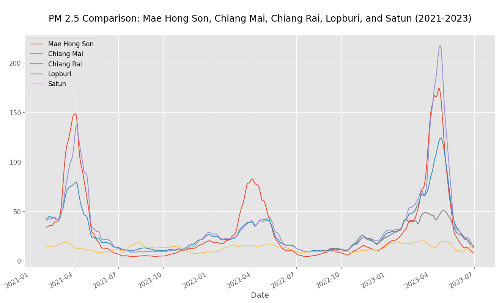
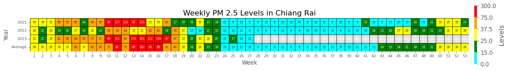
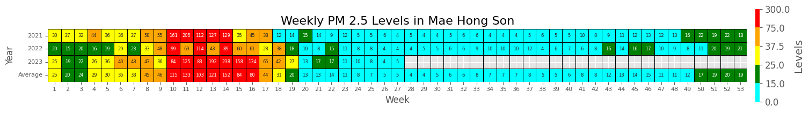
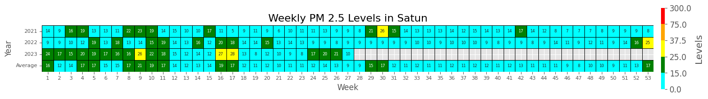
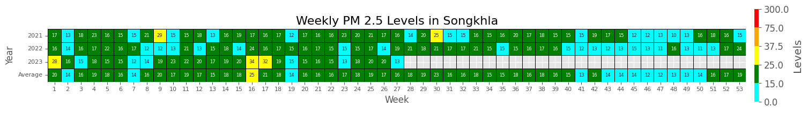
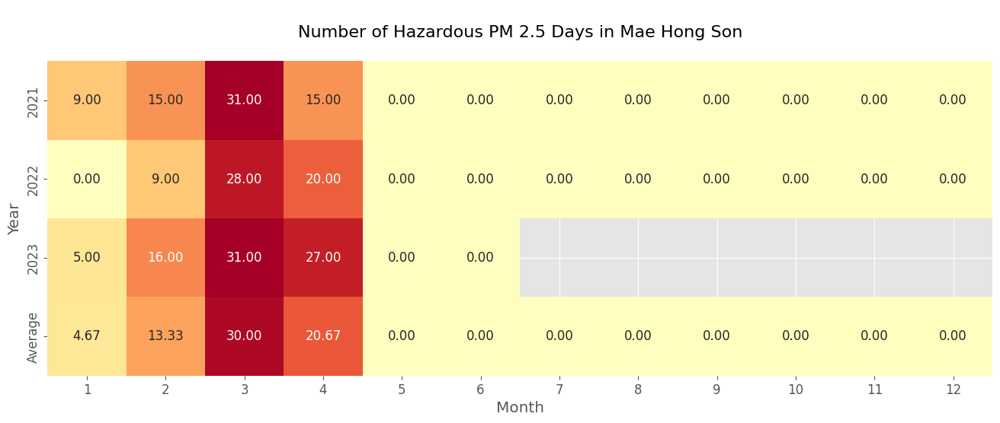
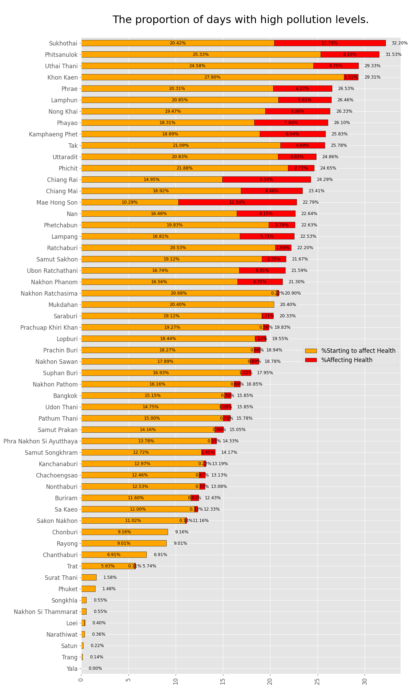
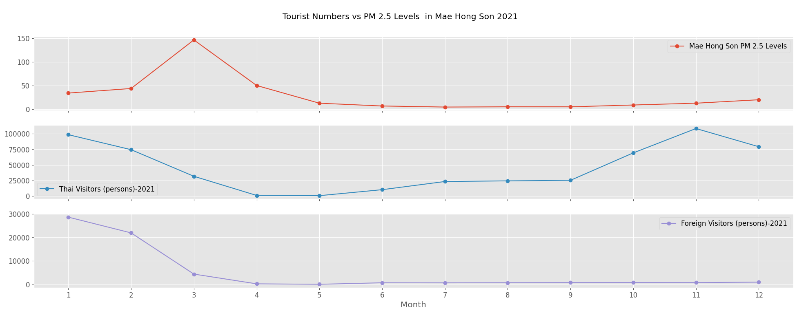
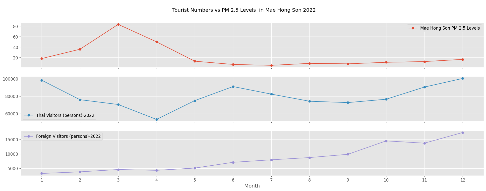
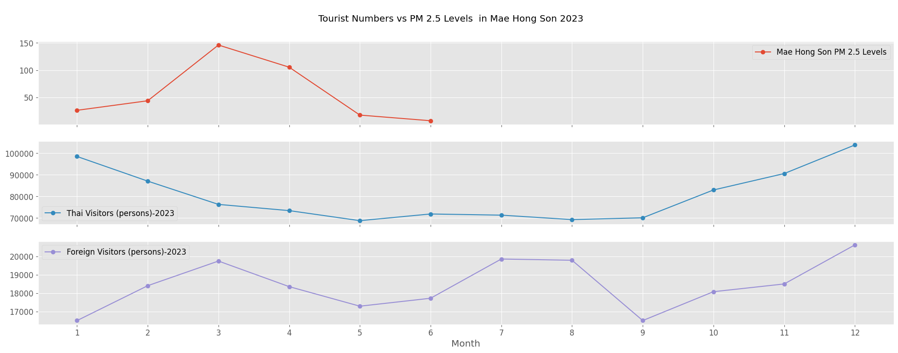

# ตะลุยเที่ยวทั่วไทย ในวันที่ไร้ฝุ่น PM 2.5
&nbsp;&nbsp;&nbsp;&nbsp; การท่องเที่ยวในยุคปัจจุบัน ไม่ได้มุ่งเน้นเพียงการเลือกสถานที่สวยงามหรือการเดินทางที่ปลอดภัยเท่านั้น แต่การพิจารณาถึง คุณภาพอากาศ ควรกลายเป็นปัจจัยสำคัญที่เราควรนำพิจารณา โดยเฉพาะมลพิษทางอากาศจาก ฝุ่น PM2.5 ที่เป็นภัยเงียบและส่งผลกระทบต่อสุขภาพอย่างรุนแรง

###  PM2.5 คืออะไร ทำไมถึงต้องกลัวและระวัง
&nbsp;&nbsp;&nbsp;&nbsp; จากข้อมูลของ กรมควบคุมโรค กระทรวงสาธารณสุข ได้ให้ความหมายของ PM2.5 ว่า เป็นฝุ่นที่มีเส้นผ่านศูนย์กลางไม่เกิน 2.5 ไมโครเมตร เกิดจากการเผาไหม้ สามารถเข้าไปถึงถุงลมปอดได้ เป็นผลทำให้เกิดโรคระบบทางเดินหายใจ และโรคปอดต่าง ๆ หากได้รับในปริมาณมากหรือเป็นเวลานานจะสะสมในเนื้อเยื่อปอด ทำให้การทำงานของปอดเสื่อมประสิทธิภาพลง ทำให้หลอดลมอักเสบและมีอาการหอบหืด
### ฝุ่นเท่าไหร่เรียกว่าอันตราย!!!

### สถานการณ์ฝุ่นเป็นอย่างไรบ้างในปี 2018 ถึง 2023
&nbsp;&nbsp;&nbsp;&nbsp; จากข้อมูลที่ได้มา เราจะวิเคราะห์ค่าฝุ่น PM2.5 ในแต่ละจังหวัด โดยใช้  Boxplot เพื่อแสดงการกระจายตัวของค่าฝุ่น ช่วยให้เห็นค่ากลาง (Median) และช่วงของค่าฝุ่นในแต่ละจังหวัด รวมถึงการระบุ Outliers ซึ่งเป็นค่าผิดปกติ การวิเคราะห์นี้จะช่วยให้เข้าใจสถานการณ์ฝุ่น PM2.5 ในแต่ละพื้นที่และสามารถเปรียบเทียบระหว่างจังหวัดได้

จากการวิเคราะห์ Boxplot พบว่า:

- 50% แรก ของค่าฝุ่น PM2.5 ในหลายจังหวัดกระจายตัวอยู่ในระดับที่ไม่ส่งผลกระทบต่อสุขภาพ โดยเฉพาะจังหวัดในภาคใต้และภาคตะวันออก เช่น สุราษฎร์ธานี, สงขลา และ ภูเก็ต ค่าฝุ่นส่วนใหญ่อยู่ในระดับดี (สีฟ้าและสีเขียว) ซึ่งบ่งบอกถึงคุณภาพอากาศที่ดีและปลอดภัย
- 50% หลัง แสดงให้เห็นว่าจังหวัดทางภาคเหนือ เช่น เชียงราย, เชียงใหม่ และแม่ฮ่องสอน  โดยมีค่าฝุ่น PM2.5 Outliers ที่พุ่งเกิน 200 ไมโครกรัม/ลูกบาศก์เมตร ซึ่งอยู่ในระดับอันตรายต่อสุขภาพ

### วิเคราะห์เชิงลึกจาก Boxplot สู่การจับกลุ่ม Dendrogram
&nbsp;&nbsp;&nbsp;&nbsp;หลังจากที่เราได้เห็นการกระจายตัวของค่าฝุ่น PM2.5 ในแต่ละจังหวัดผ่าน Boxplot ซึ่งช่วยให้เราเข้าใจระดับฝุ่นในแต่ละพื้นที่ ตอนนี้เราจะมาดูการวิเคราะห์ในเชิงลึกต่อไป เพื่อให้เห็นภาพรวมของความคล้ายคลึงกันหรือความแตกต่างระหว่างจังหวัดต่างๆ ในเรื่องของค่าฝุ่น PM2.5 เราจะใช้ Dendrogram ในการแบ่งกลุ่มจังหวัดที่มีลักษณะค่าฝุ่นใกล้เคียงกัน กราฟนี้จะช่วยให้เราสามารถมองเห็นว่าจังหวัดไหนมีแนวโน้มคล้ายกันในแง่ของมลพิษทางอากาศ โดยแบ่งจังหวัดต่างๆ ออกเป็นกลุ่มๆ ตามความคล้ายคลึงกันของข้อมูล

&nbsp;&nbsp;&nbsp;&nbsp;การวิเคราะห์นี้จะทำให้เราสามารถระบุได้ชัดเจนขึ้นว่าภูมิภาคไหนมีสถานการณ์ฝุ่นที่คล้ายคลึงกัน และช่วยให้เราเข้าใจภาพรวมของมลพิษ PM2.5 ในประเทศไทยมากยิ่งขึ้น โดย Dendrogram แสดงให้เห็นการจัดกลุ่มจังหวัดในประเทศไทยตามค่าฝุ่น PM2.5 โดยชี้ให้เห็นว่าจังหวัดในภาคเหนือ เช่น เชียงราย และ แม่ฮ่องสอน มีค่าฝุ่นสูงและถูกจัดกลุ่มร่วมกัน ซึ่งบ่งบอกถึงปัญหามลพิษทางอากาศที่รุนแรงในภูมิภาคนี้ ในทางตรงกันข้าม จังหวัดในภาคใต้และภาคตะวันออก เช่น สงขลา และ สตูล มีค่าฝุ่นต่ำกว่าอย่างชัดเจน แสดงถึงคุณภาพอากาศที่ดีขึ้น การจัดกลุ่มช่วยให้เราสามารถตัดสินใจเลือกจังหวัดที่มีอากาศดี และหลีกเลี่ยงจังหวัดที่มีปัญหาฝุ่นสูงได้ง่ายขึ้น เช่น หากเราต้องการไปท่องเที่ยวในช่วงที่ฝุ่นสูง เราอาจเลือกกลุ่มจังหวัดที่ค่าฝุ่นต่ำ เช่น ภาคใต้หรือภาคตะวันออก

### ต่อยอดการวิเคราะห์ความสัมพันธ์ผ่าน Line chart

### เจาะลึกค่าฝุ่น PM2.5 ในแต่ละภูมิภาค ภาคไหนฝุ่นพุ่ง ภาคไหนอากาศดี พร้อมวางแผนเที่ยวได้ตลอดปี!
&nbsp;&nbsp;&nbsp;&nbsp;หลังจากเห็นการจัดกลุ่มจังหวัดตามค่าฝุ่น PM2.5 ผ่าน Dendrogram แล้ว กราฟ Average PM2.5 Levels ในแต่ละภูมิภาคแสดงให้เห็นแนวโน้มค่าฝุ่นในแต่ละเดือนชัดเจนมากขึ้น ซึ่งเป็นข้อมูลที่มีประโยชน์สำหรับการวางแผนการท่องเที่ยวในแต่ละช่วงเวลา มาดูกันว่าภาคไหนฝุ่นพุ่งสูง ภาคไหนอากาศดีน่าเที่ยวกันบ้าง

 

 1. ภาคเหนือ: ช่วงฝุ่นพุ่งสูงสุดในต้นปี
ภาคเหนือ มีค่าฝุ่น PM2.5 สูงมากในช่วงเดือน มกราคมถึงเมษายน สาเหตุหลักมาจากการเผาป่าที่ส่งผลให้ค่าฝุ่นพุ่งทะลุเกิน 90 ไมโครกรัม/ลูกบาศก์เมตร ซึ่งถือว่าเป็นระดับที่มีผลกระทบต่อสุขภาพอย่างมาก
- อ้างอิงจากข้อมูลของกรมอุทยานแห่งชาติ สัตว์ป่า และพันธุ์พืช พบว่าในระยะเวลา 10 ปี (2556-2565) ภาคเหนือมีเหตุการณ์ไฟไหม้ป่าถึง 36,030 ครั้ง ครอบคลุมพื้นที่กว่า 612,435 ไร่ คิดเป็น 68.63% ของพื้นที่ป่าที่ถูกเผาทั่วประเทศ นี่จึงเป็นเหตุผลหลักที่ทำให้ค่าฝุ่นในภาคเหนือสูงในช่วงเวลาดังกล่าว
 2. ภาคใต้และภาคตะวันออก: อากาศดีเกือบตลอดปี
สำหรับนักท่องเที่ยวที่ต้องการหนีฝุ่นและมองหาที่เที่ยวที่มีอากาศบริสุทธิ์ ภาคใต้ และ ภาคตะวันออก เป็นตัวเลือกที่ดี เพราะมีค่าฝุ่น PM2.5 ต่ำเกือบตลอดทั้งปี โดยเฉพาะในช่วงที่ภาคเหนือมีปัญหาฝุ่นสูง ภาคเหล่านี้ยังคงมีค่าฝุ่นต่ำกว่า 30 ไมโครกรัม/ลูกบาศก์เมตร ซึ่งถือว่าอยู่ในระดับปลอดภัยและเหมาะสำหรับการท่องเที่ยวทั้งทะเลและธรรมชาติ
 3. ภูมิภาคอื่นๆ: ฝุ่นปานกลาง แต่ยังปลอดภัย
ภาคกลาง และ ภาคตะวันออกเฉียงเหนือ มีค่าฝุ่น PM2.5 อยู่ในระดับปานกลาง โดยส่วนใหญ่ยังคงปลอดภัย แต่ในบางเดือน เช่น ปลายปี ค่าฝุ่นอาจเพิ่มขึ้นบ้าง แต่ยังคงไม่เกินค่ามาตรฐานที่มีผลกระทบต่อสุขภาพ ภาคเหล่านี้ มีอากาศค่อนข้างบริสุทธิ์ในช่วงกลางปี ทำให้สามารถวางแผนท่องเที่ยวได้ในหลากหลายช่วงเวลา

### ดูระดับค่าฝุ่น PM 2.5 รายสัปดาห์ผ่าน Heatmap
&nbsp;&nbsp;&nbsp;&nbsp;หลังจากเห็นภาพรวมการจัดกลุ่มจังหวัดตามค่าฝุ่น PM2.5 ผ่าน Dendrogram และเห็นค่าเฉลี่ยฝุ่นรายเดือนผ่าน Bar chart เรามาดูรายละเอียดเชิงลึกด้วย Heatmap ที่แสดงการเปลี่ยนแปลงค่าฝุ่นรายสัปดาห์ในช่วงหลายปีที่ผ่านมา กราฟนี้จะช่วยให้เรามองเห็นช่วงเวลาที่ค่าฝุ่นพุ่งสูงและช่วงที่อากาศบริสุทธิ์ ซึ่งจะช่วยในการวางแผนการเดินทางหรือกิจกรรมต่างๆ ได้อย่างแม่นยำ พร้อมทั้งเฝ้าระวังช่วงเวลาที่ค่าฝุ่นสูง เราจะยกตัวอย่าง Heatmap ที่แสดงค่าฝุ่น PM2.5 รายสัปดาห์สำหรับ 2 จังหวัดทางภาคเหนือ คือ  เชียงราย แม่ฮ่องสอน  ที่มีค่าฝุ่นสูงและจะเปรียบเทียบกับ 2 จังหวัดในภาคใต้ ที่มีค่าฝุ่นต่ำ เช่น สงขลา และ สตูล ที่มีอากาศบริสุทธิ์เกือบตลอดทั้งปี ทำให้ข้อมูลนี้เป็นตัวช่วยสำคัญในการวางแผนการเดินทางในแต่ละภูมิภาคอย่างปลอดภัยและเหมาะสม 

&nbsp;&nbsp;&nbsp;&nbsp; การดูระดับค่าฝุ่น PM 2.5 รายสัปดาห์ผ่าน Heatmap ช่วยให้เราเห็นความเปลี่ยนแปลงของค่าฝุ่นในแต่ละจังหวัดตลอดปี โดยใน Heatmap นี้ เราจะเห็นตัวเลขและสีที่บ่งบอกระดับฝุ่นในแต่ละสัปดาห์ ซึ่งช่วยให้เห็นภาพรวมและรายละเอียดชัดเจนขึ้น

- เชียงรายและแม่ฮ่องสอนในช่วงต้นปี (โดยเฉพาะสัปดาห์ที่ 10 ถึง 16) ค่าฝุ่นมักพุ่งสูงและในบางปี เช่น ปี 2023 ค่าฝุ่นในแม่ฮ่องสอนพุ่งสูงสุดถึง 238 µg./m3. ในสัปดาห์ที่ 14 โดยเฉลี่ยแล้วเดือนมีนาคมมักมีค่าฝุ่นสูงเกือบเต็มเดือน นี่บ่งชี้ว่าช่วงเวลานี้ควรหลีกเลี่ยงกิจกรรมกลางแจ้งเพื่อป้องกันผลกระทบต่อสุขภาพ
- สงขลาและสตูลค่าฝุ่นในจังหวัดเหล่านี้ส่วนใหญ่จะอยู่ในระดับต่ำ (สีฟ้าหรือเขียว) เกือบตลอดทั้งปี ค่าฝุ่นสูงสุดที่พบในสงขลาอยู่ที่ประมาณ 34 µg./m3. ในปี 2023 ในขณะที่สตูลมีระดับสูงสุดที่ 28 µg./m3. ซึ่งยังต่ำกว่าเกณฑ์ที่เป็นอันตรายอย่างมาก โดยเฉลี่ยแล้ว ช่วงกลางปีถึงปลายปีในจังหวัดเหล่านี้มีค่าฝุ่นต่ำเหมาะสำหรับการเดินทางและกิจกรรมกลางแจ้ง

&nbsp;&nbsp;&nbsp;&nbsp; สรุปแล้วกราฟนี้มีประโยชน์ในการวิเคราะห์แนวโน้มฝุ่นทำให้สามารถระบุช่วงเวลาที่ควรระมัดระวังเรื่องมลพิษ และช่วงเวลาที่อากาศบริสุทธิ์ เหมาะสำหรับการวางแผนกิจกรรมกลางแจ้ง เช่น การท่องเที่ยวหรือการทำกิจกรรมที่ต้องออกไปนอกบ้าน วางแผนการเดินทางโดยลือกช่วงที่ค่าฝุ่นต่ำและอากาศดีเหมาะสมต่อการท่องเที่ยว หรือเตรียมตัวรับมือกับมลพิษสำหรับประชาชนในพื้นที่ช่วยให้ทราบล่วงหน้าว่าจะมีช่วงไหนที่ค่าฝุ่นสูงขึ้น และเตรียมพร้อมในการป้องกันตนเอง อย่างการการสวมหน้ากากอนามัย หรือหลีกเลี่ยงการทำกิจกรรมกลางแจ้งในช่วงที่ค่าฝุ่นสูง อีกทั้งภาครัฐยังสามารถนำข้อมูลนี้ไปเผยแพร่สู่สาธารณะเพื่อเพิ่มการตระหนักรู้เกี่ยวกับปัญหามลพิษทางอากาศ และสร้างความเข้าใจถึงความสำคัญของเรื่องมลพิษและสิ่งแวดล้อม

### อยู่แม่ฮ่องสอนทั้งปี คุณสูดมลพิษไปกี่วัน (จำนวนวันและสัดส่วนความเข้มข้นของฝุ่น PM 2.5 ที่เป็นอันตราย)

     

     

&nbsp;&nbsp;&nbsp;&nbsp; จากข้อมูลระดับค่าฝุ่นรายสัปดาห์ที่เราเห็นผ่าน Heat Map แล้ว เรามาลองดูว่าถ้าเราอาศัยอยู่ในพื้นที่ที่มีค่าฝุ่นสูงมากๆตลอดทั้งปี 365 วันเลยจะเป็นอย่างไร? ที่เรากำลังดูอยู่นี้ คือการคำนวณจำนวนวันที่เกิดฝุ่นในระดับสูงเกินมาตรฐานแล้วคิดเป็นจำนวนวันเฉลี่ยที่เกิดฝุ่นเกินมาตรฐานใน 1 ปี เพื่อดูว่าจำนวนวันที่มีค่าฝุ่นอยู่ในระดับที่เป็นอันตรายต่อร่างกายคิดออกมาเป็นกี่วันใน 12 เดือน เฉลี่ยในปี 2021 - 2023 จากกราฟเราจะยกตัวอย่างของจังหวัดแม่ฮ่องสอนในเดือนมีนาคม จะเห็นว่าค่าฝุ่นพุ่งสูงมากไปถึง 31 วัน นั้นหมายความว่าตลอดทั้งเดือนคุณต้องสูดเอาอากาศที่เป็นอันตรายเข้าไปปอดไปในทุก ๆ เช้า โดยกราฟนี้ได้แสดงให้เห็นว่า

- เดือนที่มีจำนวนวันที่ฝุ่นเป็นอันตรายสูงสุด: เดือนมีนาคมเป็นช่วงเวลาที่ค่าฝุ่น PM 2.5 สูงที่สุด โดยมีจำนวนวันที่ฝุ่นอยู่ในระดับอันตรายเต็ม 31 วัน ซึ่งหมายความว่าทุกวันในเดือนนี้คุณต้องเผชิญกับฝุ่นในระดับที่อาจส่งผลเสียต่อสุขภาพ
- ช่วงกลางปีถึงปลายปีที่ฝุ่นลดลง: ตั้งแต่พฤษภาคมจนถึงสิ้นปี ไม่พบวันฝุ่นอันตราย ซึ่งทำให้ช่วงกลางปีเป็นเวลาที่อากาศบริสุทธิ์มากขึ้น เหมาะสำหรับการทำกิจกรรมกลางแจ้งหรือการท่องเที่ยว
การวิเคราะห์ตัวเลขเหล่านี้ช่วยให้เข้าใจแนวโน้มของมลพิษทางอากาศในแม่ฮ่องสอนอย่างชัดเจน ช่วงต้นปีเป็นช่วงเวลาที่ต้องเฝ้าระวังอย่างสูง ส่วนช่วงกลางปีถึงปลายปีนั้นมีอากาศบริสุทธิ์และปลอดภัยมากขึ้น

&nbsp;&nbsp;&nbsp;&nbsp; หลังจากที่ได้เจาะดูจำนวนวันที่ค่าฝุ่นเป็นอันตรายในจังหวัดแม่ฮ่องสอนแล้ว เห็นได้ว่ามีความรุนแรงมากแค่ไหน แต่ไม่เพียงแค่จังหวัดแม่ฮ่องสอนเท่านั้นที่มีจำนวนวันที่อากาศเป็นพิษ เรามาดูสัดส่วนของค่าฝุ่นที่เป็นอันตรายกับสุขภาพกัน จากกราฟต่อไปนี้

  

- หากมาพิจารณาที่สัดส่วนจำนวนวันที่แสดงให้เห็นข้อมูลค่าฝุ่นที่อยู่ในระดับเป็นอันตราย เช่น จังหวัดแม่ฮ่องสอน มีสัดส่วนวันที่ค่าฝุ่น PM 2.5 อยู่ในระดับ สูง ที่ 10.29% ซึ่งบ่งชี้ถึงวันที่คุณภาพอากาศเริ่มส่งผลกระทบต่อสุขภาพ และมีสัดส่วนวันที่ค่าฝุ่นแยกถึงระดับอันตรายถึงที่ 12.50% ซึ่งแสดงถึงวันที่คุณภาพอากาศเป็นอันตรายต่อสุขภาพของทุกคน กล่าวได้ว่า 100 วันที่อาศัยอยู่ในจังหวัดนี้ มีวันที่คุณสูดอากาศที่เป็นอันตรายไปแล้ว 23 วัน
หากอาศัยอยู่ 1 ปี  ก็มีวันที่สูดอากาศแย่ๆไป 84 วัน….

- ภาพรวมนี้แสดงให้เห็นถึงความแตกต่างของคุณภาพอากาศระหว่างจังหวัดต่างๆ หากคุณอาศัยอยู่ในจังหวัดที่มีสัดส่วนวันที่ฝุ่น PM 2.5 สูงในระดับอันตรายมากเป็นระยะเวลานานหลายปีคุณจะต้องเผชิญกับความเสี่ยงต่อสุขภาพที่มากกว่าเมื่อเทียบกับจังหวัดที่มีสัดส่วนต่ำ สัดส่วนเหล่านี้สะท้อนถึงสภาพแวดล้อมที่อาจส่งผลต่อคุณภาพชีวิตและสุขภาพของประชาชนในแต่ละพื้นที่อย่างชัดเจน นอกจากนี้ยังแสดงให้เห็นถึงความแตกต่างอย่างชัดเจนระหว่างจังหวัดต่างๆ จังหวัดที่มีสัดส่วนวันที่ฝุ่นอยู่ในระดับ สูง และสูงมาก เช่น เชียงราย, เชียงใหม่ และน่าน แสดงว่าผู้ที่อาศัยอยู่ในจังหวัดเหล่านี้จะต้องเผชิญกับความเสี่ยงทางสุขภาพจากมลพิษทางอากาศมากกว่าจังหวัดที่มีสัดส่วนต่ำกว่าในขณะที่จังหวัดเช่น ระนอง, ภูเก็ต และสุราษฎร์ธานีแทบจะไม่มีวันที่ค่าฝุ่น PM 2.5 ขึ้นไปถึงระดับสูงมากเลยแสดงว่าผู้คนในพื้นที่เหล่านี้มีคุณภาพอากาศที่ดีกว่า และความเสี่ยงต่อสุขภาพที่เกี่ยวข้องกับฝุ่นละอองก็ต่ำกว่ามาก

- การมีสัดส่วนวันที่ฝุ่นสูงแตกต่างกันในแต่ละจังหวัด สะท้อนถึงสภาพแวดล้อมทางอากาศที่ไม่เท่ากันในแต่ละพื้นที่ซึ่งอาจเกิดจากปัจจัยต่างๆ เช่น ลักษณะภูมิประเทศ, กิจกรรมอุตสาหกรรม หรือปัจจัยทางภูมิอากาศ การทำความเข้าใจความแตกต่างนี้ช่วยให้เราตระหนักถึงคุณภาพชีวิตและความเสี่ยงต่อสุขภาพของผู้คนในแต่ละพื้นที่ได้ดียิ่งขึ้น อีกทั้งยังช่วยในการวางแผนจัดการคุณภาพอากาศและลดผลกระทบต่อสุขภาพของประชาชนในระยะยาว

### การท่องเที่ยว VS. ความปลอดภัยของสุขภาพ

ในประเด็นสุดท้ายที่จะพูดถึง คือเรื่องของความตระหนักรู้ถึงความปลอดภัยในสถานที่ท่องเที่ยว อธิบายด้วยกราฟเส้นที่แสดงข้อมูลจำนวนนักท่องเที่ยวชาวไทยและชาวต่างชาติที่เดินทางมาท่องเที่ยวที่แม่ฮ่องสอนในปี 2021 - 2023 เทียบกับระดับฝุ่น PM 2.5 ที่เปลี่ยนแปลงไปในแต่ละเดือน
    

- ในปี 2021 ระดับฝุ่น PM 2.5 ในแม่ฮ่องสอนสูงสุดในเดือนมีนาคม โดยพุ่งขึ้นอย่างมากจนอาจส่งผลต่อสุขภาพ หลังจากนั้น ค่าฝุ่นค่อย ๆ ลดลง และตั้งแต่เดือนพฤษภาคมเป็นต้นไป ระดับฝุ่นคงอยู่ในระดับต่ำซึ่งปลอดภัยต่อสุขภาพมากขึ้น
- เมื่อดูจำนวนนักท่องเที่ยวในช่วงเวลาเดียวกัน พบว่าชาวไทยลดลงอย่างชัดเจน โดยจากประมาณ 100,000 คนในเดือนมกราคม เหลือเพียง 25,000 คนในเดือนเมษายน ซึ่งสอดคล้องกับช่วงที่ค่าฝุ่นสูง นักท่องเที่ยวต่างชาติก็มีจำนวนไม่มากและลดลงต่อเนื่องในช่วงต้นปีเช่นกัน หลังจากนั้นในช่วงกลางปีจนถึงปลายปี นักท่องเที่ยวต่างชาติแทบไม่มีเลย ซึ่งอาจเป็นผลมาจากฝุ่นที่สูงและผลกระทบของ COVID-19
- อย่างไรก็ตาม หลังจากเดือนมิถุนายนที่ค่าฝุ่นลดลง จำนวนนักท่องเที่ยวไทยเริ่มเพิ่มขึ้นอย่างต่อเนื่อง โดยเฉพาะในเดือนตุลาคมที่มีจำนวนนักท่องเที่ยวสูง  ส่วนจำนวนนักท่องเที่ยวต่างชาติเริ่มฟื้นตัวและเพิ่มสูงสุดในเดือนธันวาคม ซึ่งเป็นช่วงเวลาที่ค่าฝุ่นอยู่ในระดับปลอดภัย 

  
- ในปี 2022 ระดับฝุ่น PM 2.5 ที่แม่ฮ่องสอนสูงสุดในเดือนมีนาคมกระทบต่อสุขภาพ ลดลงอย่างต่อเนื่องหลังเดือนมีนาคม และตั้งแต่เดือนพฤษภาคมเป็นต้นไป คงอยู่ในระดับต่ำจนถึงสิ้นปี ทำให้อากาศมีความปลอดภัยมากขึ้น
- ในขณะที่จำนวนนักท่องเที่ยวชาวไทยลดลงจากประมาณ 100,000 คนในเดือนมกราคมเหลือเพียงประมาณ 60,000 คนในเดือนเมษายน ซึ่งตรงกับช่วงที่ค่าฝุ่นสูง ก่อนจะเริ่มฟื้นตัวขึ้นในช่วงครึ่งปีหลัง โดยเพิ่มขึ้นสูงสุดในเดือนธันวาคมที่เกือบ 100,000 คน
- สำหรับนักท่องเที่ยวชาวต่างชาติ แม้ในต้นปีจะมีจำนวนน้อยและลดลง แต่กลับเพิ่มขึ้นในช่วงครึ่งหลังของปี โดยเฉพาะในเดือนธันวาคมที่มีจำนวนประมาณ 15,000 คน เป็นช่วงที่ค่าฝุ่นอยู่ในระดับปลอดภัย  

  
- ในปี 2023 ระดับฝุ่น PM 2.5 ในแม่ฮ่องสอนสูงสุดในเดือนมีนาคมเช่นกันซึ่งอาจส่งผลกระทบต่อสุขภาพอย่างมาก หลังจากนั้น ค่าฝุ่นลดลงอย่างต่อเนื่อง 
- ในขณะเดียวกัน จำนวนนักท่องเที่ยวไทยลดลงจากประมาณ 100,000 คนในเดือนมกราคม เหลือเพียง 70,000 คนในเดือนเมษายน ซึ่งสอดคล้องกับช่วงที่ค่าฝุ่นสูง จากนั้นจำนวนนักท่องเที่ยวชาวไทยฟื้นตัวขึ้นในช่วงครึ่งปีหลัง อย่างต่อเนื่องจนถึงเดือนธันวาคม ซึ่งมีจำนวนสูงสุดกว่า 100,000 คน
- สำหรับนักท่องเที่ยวชาวต่างชาติ แม้ในต้นปีจะมีจำนวนเพิ่มขึ้นในช่วงแรก แต่ก็ลดลงในช่วงกลางปีและกลับมาเพิ่มขึ้นอีกครั้งในเดือนตุลาคม โดยมีจำนวนสูงสุดในเดือนธันวาคมที่ประมาณ 20,000 คน ในช่วงที่ค่าฝุ่นต่ำและอากาศปลอดโปร่ง เหมาะแก่การท่องเที่ยว

&nbsp;&nbsp;&nbsp;&nbsp; กราฟนี้แสดงข้อมูลจำนวนนักท่องเที่ยวชาวไทยและชาวต่างชาติที่เดินทางมาท่องเที่ยวที่แม่ฮ่องสอนในปี 2021 - 2023 เทียบกับระดับฝุ่น PM 2.5 ที่เปลี่ยนแปลงไปในแต่ละเดือน เบื้องต้นจะเห็นได้ว่าค่าฝุ่น PM 2.5 และจำนวนนักท่องเที่ยวที่เดินทางมาแม่ฮ่องสอนในแต่ละปีมีความสอดคล้องกัน โดยเฉพาะอย่างยิ่งในช่วงเวลาที่ค่าฝุ่นสูงจะสัมพันธ์กับการลดลงของจำนวนนักท่องเที่ยว แต่ทั้งนี้เมื่อพิจารณาจากช่วงเวลาของเทศกาลท่องเที่ยว (low season) แล้วก็เป็นอีกปัจจัยที่ทำให้จำนวนนักท่องเที่ยวลดลงได้ กล่าวคือปัจจัยที่มีผลกระทบต่อการท่องเที่ยวในจังหวัดแม่ฮ่องสอนสามารถเกิดจากมลพิษทางอากาศและช่วงเวลาในปีที่การท่องเที่ยวลดลงเองตามฤดูกาล

### Summary

&nbsp;&nbsp;&nbsp;&nbsp; สุดท้ายนี้การท่องเที่ยวในยุคที่ฝุ่น PM 2.5 กลายเป็นภัยเงียบที่ส่งผลกระทบต่อสุขภาพของเราอย่างหลีกเลี่ยงไม่ได้ อีกทั้งการท่องเที่ยวในยุคปัจจุบันไม่ได้มุ่งเน้นเพียงแค่การเลือกสถานที่สวยงามหรือการเดินทางที่ปลอดภัยเท่านั้น แต่ยังต้องพิจารณาคุณภาพอากาศ โดยเฉพาะมลพิษจากฝุ่น PM2.5 ซึ่งมีผลกระทบต่อสุขภาพอย่างมาก การวิเคราะห์ข้อมูลฝุ่น PM2.5 ที่เราได้นำเสนอ เช่น การใช้ Boxplot, Dendrogram และ Heatmap แสดงให้เห็นถึงแนวโน้มของค่าฝุ่นในแต่ละจังหวัด ช่วยให้นักท่องเที่ยวสามารถเลือกช่วงเวลาและพื้นที่ท่องเที่ยวที่มีอากาศบริสุทธิ์และปลอดภัยได้ นอกจากนี้ ข้อมูลนี้ยังมีความสำคัญในการเฝ้าระวังและเตรียมตัวรับมือกับมลพิษทางอากาศอย่างเหมาะสม เพื่อให้การเดินทางปลอดภัยและส่งเสริมสุขภาพที่ดีในระยะยาว การท่องเที่ยวอย่างใส่ใจสุขภาพจึงเป็นการส่งเสริมการเดินทางที่ปลอดภัยและยั่งยืน 

### Our Challenge
- ใช้เวลาในการรวบรวมข้อมูลค่อนข้างนาน: การรวบรวมข้อมูลใช้เวลานานกว่าที่คาดไว้ เนื่องจากบางแหล่งข้อมูลมีข้อมูลที่ไม่ครบถ้วนหรือขาดหายไปมาก ทำให้เราต้องหาแหล่งข้อมูลใหม่เพื่อใช้ในการวิเคราะห์ ส่งผลให้กระบวนการทำงานล่าช้า
- การ Clean Data: ข้อมูลที่ได้รับต้องผ่านกระบวนการเตรียมความพร้อมก่อนที่จะนำไปวิเคราะห์และทำการ Visualize ซึ่งการทำ Data Cleaning นี้ใช้เวลามาก เนื่องจากต้องจัดการกับข้อมูลที่ขาดหาย ข้อมูลที่ซ้ำซ้อน หรือข้อมูลที่มีความผิดปกติ เพื่อให้ข้อมูลมีคุณภาพและพร้อมสำหรับการนำไปวิเคราะห์อย่างถูกต้อง
- ข้อมูลด้านอื่นที่ต้องการใช้วิเคราะห์ไม่สามารถหาได้: ข้อมูลบางส่วนที่จำเป็นสำหรับการวิเคราะห์เพิ่มเติมไม่สามารถรวบรวมได้ ทำให้ไม่สามารถดำเนินการวิเคราะห์ในบางส่วนตามที่วางแผนไว้ได้

### Data Set: ข้อมูลคุณภาพอากาศจากจุดตรวจวัดคุณภาพอากาศ จากกรมควบคุมมลพิษ
- ข้อมูลฝุ่นละอองขนาดไม่เกิน 2.5 ไมครอน (PM2.5) รายวัน จำแนกรายสถานี (กรมควบคุมมลพิษทำการเก็บรวบรวมข้อมูลเป็นรายวันจากจุดตรวจวัดคุณภาพอากาศอัตโนมัติของกรมควบคุมมลพิษ ซึ่งกรมควบคุมมลพิษนำมาจัดทำรายงานเป็นรายปี)
  - URL: https://pcd.gdcatalog.go.th/it/dataset/air-quality-bangkok-metropolitan-region
- สถิตินักท่องเที่ยว จากกระทรวงการท่องเที่ยวและกีฬา
  - URL: https://www.mots.go.th/news/category/411
